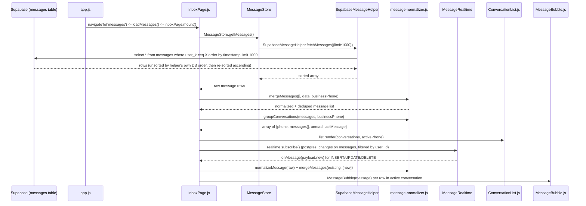
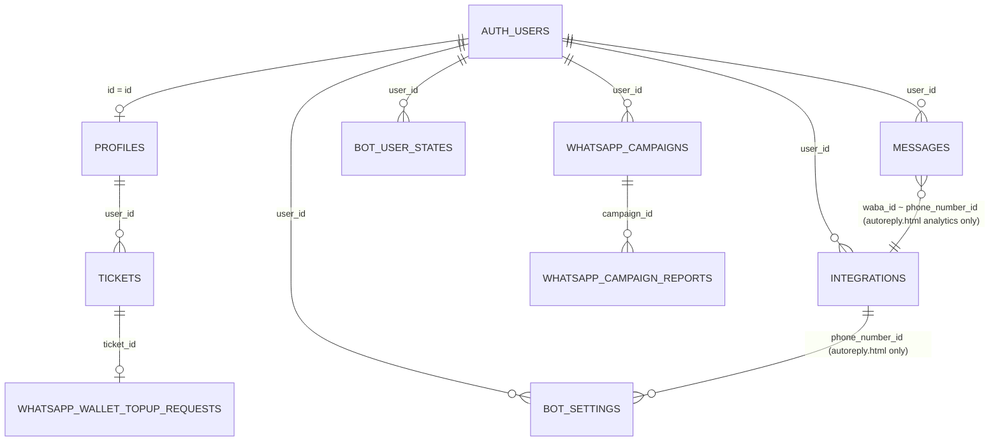
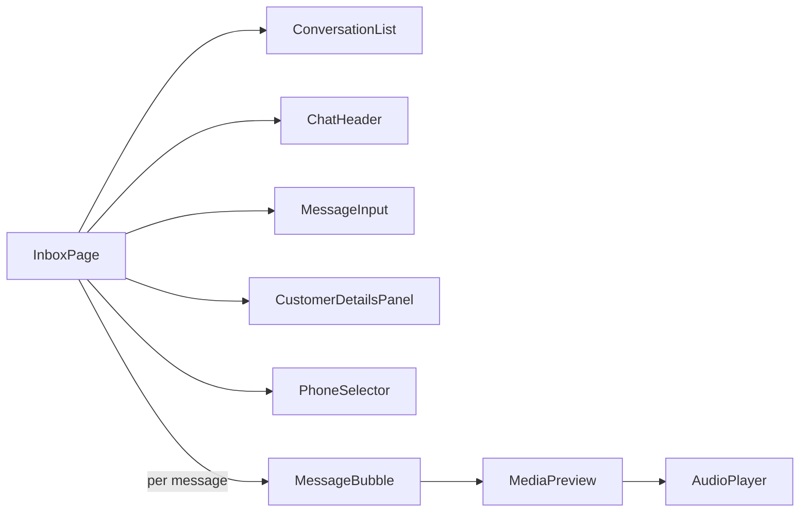

# ARCHITECTURE_AND_INVESTIGATION.md

> **Scope note (read first):** This document was produced from a static review of the source files provided in this conversation. No runtime access, logs, live database, or bug report/reproduction steps were provided alongside the code. Every claim below is labeled as **Fact** (directly observable in the pasted source), **Evidence** (an artifact that supports but does not alone prove a claim), **Assumption** (unverified but reasonable inference), or **Unknown** (not determinable from what was provided). No code was modified to produce this document.

---

## 1. Project Overview

### 1.1 What this repository is

**Fact:** Per the task's "Important Architecture Context" section, this repository is the **WhatsApp Business module** of a larger platform called **Mad3oom (مدعوم)**. It is explicitly *not* a standalone product — it's meant to plug into platform-level Authentication, User Management, Ticketing, Billing, Notifications, and future MCP/Workflow/SIE systems.

**Evidence for this in the code itself:**
- `constants.js` defines `INTERNAL_SYSTEM_SUBDOMAINS` and `shouldValidateSubdomain()`, implying a multi-tenant subdomain system (`*.wa.mad3oom.com`) tied to a root platform.
- `login.html` and its inline script talk to a **shared Supabase project** (`srnelrdpqkcntbgudyto.supabase.co`) and reads/writes a `profiles` table that is clearly shared platform-wide (roles: `admin`, `support`, `super_user`, `user`).
- `services/wallet-service.js` and `whatsapp-wallet-topup-service.js` explicitly reuse the platform's existing `tickets` / `ticket_attachments` tables and Storage bucket rather than creating new ones, with extensive comments explaining this is intentional reuse of platform infrastructure.
- `pages/UsersManagementPage.js` reads `profiles` and gates access via `profiles.email === 'support@mad3oom.online'` or `profiles.role === 'admin'` — i.e., platform-level roles.

### 1.2 Technology stack

**Fact**, observed directly in source:
- **Frontend:** Vanilla JavaScript (ES modules), no frontend framework (React/Vue) for the WhatsApp module pages — components are hand-rolled classes that build innerHTML strings (e.g., `InboxPage`, `ConversationList`, `MessageBubble`).
- **Styling:** Plain CSS files (`main.css`, `whatsapp-theme.css`, `flow-editor*.css`, etc.), CSS custom properties for theming, `Cairo` Google Font for Arabic UI, RTL (`dir="rtl"`) throughout.
- **Backend-as-a-service:** **Supabase** (Postgres + Auth + Realtime + Storage + Edge Functions), accessed via `@supabase/supabase-js@2` loaded from a CDN (`https://cdn.jsdelivr.net/npm/@supabase/supabase-js@2.38.0/+esm`).
- **External API integration:** **Meta WhatsApp Cloud API** (Graph API `v25.0`), called directly from the browser in `services/whatsapp-api.js` using a stored `access_token`.
- **OAuth:** Facebook JS SDK (`connect.facebook.net/.../sdk.js`) + Meta **Embedded Signup** flow (`oauth.js`), exchanging an auth code via a Supabase Edge Function (`exchange-token`).
- **The standalone `autoreply.html`** is a separate, self-contained page (its own `<script type="module">` with its own inline Supabase client init) implementing a visual flow-builder for auto-replies, entirely decoupled from `app.js`/`AutoReplyPageV2.js`.
- **Excel import/export:** SheetJS (`xlsx`), lazy-loaded from CDN in `autoreply.html`.
- **Drawflow** library (`jerosoler/Drawflow`) is loaded in `dashboard.html` and referenced by `AutoReplyPageV2.js`, but is a **different, older implementation** of the flow editor than the hand-rolled canvas/SVG engine in `autoreply.html`.

### 1.3 High-level module map

**Fact**, based on `app.js`'s imports and `navigateTo()` dispatch table:

```mermaid
flowchart TB
    subgraph Entry["Entry Points"]
        DH[dashboard.html]
        LH[login.html]
        AR[autoreply.html - standalone]
        IDX[index.html - marketing]
    end

    subgraph Core["Core Bootstrapping"]
        APP[app.js]
        SI[supabase-integration.js]
        OAUTH[oauth.js]
        SC[supabase-config.js]
    end

    subgraph Pages["Page Controllers (app.js-driven)"]
        INBOX[pages/InboxPage.js]
        TPL[pages/TemplatesPage.js]
        ARV2[pages/AutoReplyPageV2.js]
        USERS[pages/UsersManagementPage.js]
        STATUS[pages/StatusPage.js]
        SETTINGS[pages/SettingsPage.js]
        DEV[pages/DeveloperSettingsPage.js]
        SEND[pages/SendMessagePage.js]
        REPORTS[pages/CampaignReportPage.js]
        ACTIVITY[pages/ActivityFeedPage.js]
        WALLET[pages/WalletPage.js]
    end

    subgraph InboxParts["Inbox Sub-components"]
        CL[components/ConversationList.js]
        CH[components/ChatHeader.js]
        MI[components/MessageInput.js]
        MB[components/MessageBubble.js]
        MP[components/MediaPreview.js]
        CDP[components/CustomerDetailsPanel.js]
        PS[components/PhoneSelector.js]
    end

    subgraph Services["Services / Data Access"]
        MS[services/message-store.js]
        SMH[services/supabase-message-helper.js]
        WAAPI[services/whatsapp-api.js]
        MRT[realtime/message-realtime.js]
        MN[utils/message-normalizer.js]
        WSVC[services/wallet-service.js]
        WPRICE[services/wallet-pricing.js]
        BMS[services/billing-mode-service.js]
        MBS[services/meta-billing-service.js]
    end

    subgraph External["External Systems"]
        SB[(Supabase Postgres/Auth/Realtime)]
        META[Meta Graph API v25.0]
        EDGE[Supabase Edge Functions]
    end

    DH --> APP
    APP --> SI --> SC
    APP --> OAUTH
    APP --> INBOX
    INBOX --> CL & CH & MI & MB & MP & CDP & PS
    INBOX --> MS --> SMH --> SI
    INBOX --> MRT --> SI
    INBOX --> MN
    APP --> WAAPI --> SI
    WAAPI --> META
    WAAPI --> WSVC & BMS & MBS
    OAUTH --> EDGE
    SI --> SB
    AR -. "own inline Supabase client, same project" .-> SB
```



**Important architectural observation (Fact):** `autoreply.html` does **not** import `supabase-integration.js`. It re-implements its own Supabase client bootstrap inline (`SUPA_URL`, `SUPA_KEY` hardcoded, matching `supabase-config.js`'s values per its own code comment). This is a **duplicated integration point**, not a shared one. `AutoReplyPageV2.js` (used by `app.js`/`dashboard.html`) is a **second, independent implementation** of an auto-reply flow editor, backed by the **Drawflow** library, that writes to the same `bot_settings.custom_replies` column but with a completely different node/JSON shape than the one `autoreply.html` produces. This is flagged in detail in §6 and §8.

---

## 2. WhatsApp Message Flow

### 2.1 Requested lifecycle vs. what evidence supports

The task asked me to trace: `Meta Webhook → Webhook Processing → Database Insert → Supabase → Frontend Fetch → Normalization → Conversation Builder → Inbox Rendering`.

**Critical finding (Fact):** **No webhook receiver/processor code exists anywhere in the provided files.** There is no server-side handler, no Supabase Edge Function source, and no code that receives a POST from Meta's webhook system. The word "webhook" appears only in:
- `DeveloperSettingsPage.js` — a **UI field** for the customer to type in *their own* outbound webhook URL (`metadata.webhook_url`), stored on the `integrations` row. This is Mad3oom forwarding data *out* to the customer's system, not Mad3oom receiving Meta's webhook.
- `whatsapp-cloud-api-faq.html` — a static FAQ article *explaining* WhatsApp webhooks conceptually; not implementation.
- `oauth.js` — subscribes the app to Meta's webhook system as part of Embedded Signup (`whatsapp_business_messaging` permission implies webhook delivery), but the code that *receives* those deliveries is not present.
- `integration-example.js` — contains a `setupWhatsAppWebhook()` function that is explicitly a **polling simulation**, not a real webhook receiver:
```js
  function setupWhatsAppWebhook() {
      // هذا يعتمد على طريقة استقبال الـ webhooks في تطبيقك
      // مثال باستخدام polling من قاعدة البيانات:
      setInterval(async () => { ... }, 5000);
  }
```
  This file is explicitly framed as an "integration example," and its own comments concede that real webhook receipt depends on infrastructure not shown here.

**Conclusion:** The actual `Meta Webhook → Webhook Processing → Database Insert` portion of the pipeline is **entirely outside this repository's visible surface** — almost certainly a Supabase Edge Function (the same mechanism used for `exchange-token`, `register-whatsapp`, `verify-2fa`, `create-api-token`, `subdomain-auth-check`, and `pi-auth`, all of which are called by URL from this repo but whose *source* is not included). This is the single largest gap for diagnosing any inbound-message bug.

### 2.2 What IS verifiable: `Supabase → Frontend Fetch → Normalization → Conversation Builder → Inbox Rendering`

This half of the pipeline is fully present in code. Below is the traced, evidence-based flow.



#### Stage-by-stage detail (Fact, from source)

**Stage: Frontend Fetch**
- `MessageStore.getMessages()` (`services/message-store.js`) is a thin wrapper: `SupabaseMessageHelper.fetchMessages({ limit: 1000 })`.
- `SupabaseMessageHelper.fetchMessages()` (`services/supabase-message-helper.js`):
```js
  const { data, error } = await supabase
    .from(TABLE) // 'messages'
    .select('*')
    .eq('user_id', userId)
    .order('timestamp', { ascending: false })
    .limit(limit);
  // then re-sorted ascending client-side
```
  - **Fact:** This fetch is **not scoped by phone number / WABA / integration** — it pulls *all* messages for the `user_id`, capped at 1000, ordered by `timestamp` descending then re-sorted ascending in JS.
  - **Fact:** `TABLE = 'messages'`. The file's own comments state the real column names are `file_url`, `attachment_type`, `mime_type`, `file_name`, `file_size`, `wa_message_id`, `client_id`, `raw_data` (jsonb), `read_at` — and explicitly warn that older/incorrect field names (`media_url`, `media_id`, `metadata`, `type`) **do not exist** as columns and would silently break inserts if used raw. A `normalizeRowForDb()` function exists specifically to translate legacy field names to real column names before any insert/update.

**Stage: Normalization**
- `utils/message-normalizer.js` exports `normalizeMessage(message, businessPhone)`, which derives:
  - `direction` via `getMessageDirection()` — trusts an explicit `direction` column if present, else falls back to comparing `from_number` against `businessPhone`.
  - `conversationPhone` via `getConversationPhone()` — the "other side" of the conversation relative to `businessPhone`.
  - `text` via `getMessageText()` — tries direct columns first (`message_text`, `text`, `body`, `caption`, `content`), then falls back to parsing `metadata`/`raw_data` JSON for interactive/template/reaction/location/contacts/system message shapes.
  - `type` — normalized into `image|video|audio|document|sticker|interactive|text`.
  - `deliveryStatus` — from `delivery_status` or `status`, defaulting to `sent`/`received` by direction.
- **Fact:** `getMessageDirection()` and `getConversationPhone()` both depend on `businessPhone`, which is supplied by `InboxPage` via `getBusinessPhone: () => businessPhoneNumber` — a closure over a **module-level variable in `app.js`** (`let businessPhoneNumber = ''`), populated only inside `updateDashboard()` after a **separate** live call to Meta's Graph API (`SupabaseIntegration.getDashboardStats()`), not from the `messages` table itself.
  - **This is a load-order dependency**: if `updateDashboard()` has not yet resolved `businessPhoneNumber` by the time `InboxPage` normalizes messages, `getMessageDirection()`'s phone-comparison fallback silently produces wrong results for any row missing an explicit `direction` column value.

**Stage: Conversation Builder**
- `groupConversations(messages, businessPhone)`:
  - Iterates all messages, normalizes each, **skips** any message where `isBusinessConversation()` is true (i.e., skips rows that appear to be the business's own number talking to itself — a self-message guard).
  - Buckets by `conversationPhone` into a `Map`, tracking `unread` count (`direction === 'inbound' && !read_at`) and `lastMessage`.
  - Sorts final conversation array by `lastMessage.timestamp` descending.
- `mergeMessages(existing, incoming, businessPhone)`:
  - Builds `waIdToClientId` / `clientIdToWaId` maps first (two-pass) to reconcile optimistic client-side sends (keyed by `client_id`) with server-confirmed rows (keyed by `wa_message_id`), so a message doesn't appear twice — once as the local "sending…" bubble and once as the Realtime-confirmed row.
  - Falls back to `id` (DB primary key) as a last-resort key if neither `client_id` nor `wa_message_id` exists.

**Stage: Inbox Rendering**
- `InboxPage.render()` calls, in order: `renderList()`, `renderHeader()`, `renderMessages()`, `renderDetailsPanel()`, `checkSessionAndRenderComposer()`.
- `renderMessages()` finds the active conversation via `getActiveConversation()` (`conversations.find(c => c.phone === activePhone)`) and maps each message through `MessageBubble(message)`, joining the resulting HTML strings and injecting via `innerHTML`.
- **Fact:** `checkSessionAndRenderComposer()` implements the WhatsApp **24-hour customer service window** rule client-side: it finds the most recent `inbound` message in the active conversation and disables free-form text (showing a "send template" prompt instead) if `now - lastInboundTime >= 24h`. If there are **zero** inbound messages in the conversation at all, it also forces template-only mode.

### 2.3 Realtime update path (Fact)

`realtime/message-realtime.js`:
```js
this.channel = supabase
  .channel(`wa-messages-${userId}`)
  .on('postgres_changes', { event: 'INSERT', schema: 'public', table: 'messages', filter: `user_id=eq.${userId}` }, ...)
  .on('postgres_changes', { event: 'UPDATE', ... }, ...)
  .on('postgres_changes', { event: 'DELETE', ... }, ...)
  .subscribe((status, error) => { ... });
```
- **Fact:** Subscribed and filtered **only by `user_id`**, not by phone number, active WABA/integration, or any other scope. Every message row for that Supabase `auth.uid()` triggers `handleRealtimeMessage()` regardless of which connected WhatsApp number it belongs to.
- `InboxPage.handleRealtimeMessage(raw)` normalizes the incoming row, merges it into `this.messages`, rebuilds conversations, auto-selects a conversation if none is active, marks-as-read if it's inbound and matches the active conversation, then calls `this.render()`.

---

## 3. Database Architecture

**Important caveat (Fact):** No SQL schema, migration files, or `CREATE TABLE` statements are present in the provided files. Every table name and column name below is **inferred from application code that queries/writes it** (`.from('table_name')`, `.select('col')`, `.insert({...})`, etc.) — this is evidence, not a verified schema dump.

### 3.1 `messages`

**Referenced in:** `supabase-message-helper.js`, `message-normalizer.js`, `app.js` (`updateStatsCounters`), `ActivityFeedPage.js`, `AutoReplyPageV2` autoreply engine (indirectly).

**Columns evidenced by code:**
| Column | Evidence |
|---|---|
| `id` | primary key, used as fallback merge key in `message-normalizer.js` |
| `user_id` | filter key everywhere; FK to `auth.users` (Fact: RLS-style scoping pattern used consistently) |
| `from_number`, `to_number` | direction/conversation derivation |
| `message_text` | primary text column (comment in helper confirms) |
| `message_type` | e.g. `text`, `image`, etc. |
| `direction` | `'inbound' \| 'outbound'` |
| `status`, `delivery_status` | send/delivery state |
| `timestamp` | primary ordering column |
| `file_url`, `attachment_type`, `mime_type`, `file_name`, `file_size` | media metadata — **explicitly documented in code comments as the real column names**, replacing legacy `media_url`/`media_id`/`metadata` |
| `wa_message_id` | Meta's message ID, used for realtime/optimistic-send reconciliation |
| `client_id` | client-generated UUID for optimistic UI + idempotent upsert-like matching |
| `raw_data` (jsonb) | catch-all for interactive/template/reaction/location/contacts/system payloads; also stores `media_id` when present (per `normalizeRowForDb()`) |
| `read_at` | nullable; null = unread (used for `unread` counts and 24h-window logic upstream) |
| `waba_id` | **Fact, from `autoreply.html`'s analytics query**: `sb.from('messages').select('direction,timestamp,created_at,waba_id').eq('waba_id', currentPhoneId)` — used there to scope messages to a specific connected phone number. **This directly contradicts `SupabaseMessageHelper.fetchMessages()`, which never filters by this column.** See §6.4. |
| `created_at` | used as a timestamp fallback in multiple places (`autoreply.html`, `message-normalizer.js`'s `getMessageTimestamp`) |

### 3.2 `integrations`

**Referenced in:** `supabase-integration.js` (primary owner), `oauth.js`, `whatsapp-api.js`, `SettingsPage.js`, `DeveloperSettingsPage.js`, `UsersManagementPage.js`, `autoreply.html`.

**Fact — row shape** (from `saveIntegration()` in `supabase-integration.js`):
```js
{
  user_id, provider: 'whatsapp', phone,
  access_token, token_type, expires_in,
  metadata: {
    phone_number_id, phone_number, waba_account_id,
    business_account_id, connected_at,
    // Fact, from SettingsPage.js: billing_method ('wallet'|'meta') also stored here
    // Fact, from DeveloperSettingsPage.js: webhook_url also stored here
  }
}
```
- **Fact:** A user can have **multiple rows** with `provider='whatsapp'` (one per connected phone number) — confirmed by `getWhatsAppChannels()` returning an array, `app.js`'s phone switcher UI, and `autoreply.html`'s `loadPhoneNumbers()` filtering `integrations` by `metadata.phone_number_id`.
- **Fact:** There is no `id`-uniqueness or `updated_at` column usage anywhere for this table; `updateIntegration()` explicitly comments: *"the 'integrations' table has no 'updated_at' column - only 'created_at'."*
- **Fact — "active phone" resolution is client-side, not server-side**, and is done via **`localStorage`** key `mad3oom_wa_phone_id`, read independently in at least three places:
  1. `supabase-integration.js`'s `getIntegration()` — prefers the row matching `localStorage.getItem('mad3oom_wa_phone_id')`, else falls back to `created_at` descending (most recent).
  2. `app.js`'s `loadPhoneSwitcher()` / `selectActivePhone()` / `switchActivePhone()`.
  3. `autoreply.html`'s own `loadPhoneNumbers()` (uses the **same key name**, `mad3oom_wa_phone_id`, confirmed by direct string match), independently, in its own inline script.
- **This is a shared-but-uncoordinated cross-page state mechanism.** See §6.5.

### 3.3 `bot_settings`

**Referenced in:** `autoreply.html` (heavily), `AutoReplyPageV2.js`, `CustomerDetailsPanel.js`, `integration-example.js`.

**Fact — two incompatible consumers write to the same logical column, `custom_replies`:**
- `autoreply.html` upserts with a **composite key** `{ user_id, phone_number_id }` and `onConflict: 'user_id,phone_number_id'` — i.e., **one settings row per connected phone number**. Its `custom_replies` is a canonical array of node objects: `{id, type, x, y, ...data, connections: [{to, port}]}`.
- `AutoReplyPageV2.js` (`saveFlowData()`) upserts with `{ user_id, custom_replies: data }` and `onConflict: 'user_id'` — **one settings row per user, with no `phone_number_id` at all**, and `data` is the **Drawflow library's own export format** (`{drawflow: {Home: {data: {...}}}}`), a completely different JSON shape.
- **Fact:** `autoreply.html`'s own `parseStoredFlow()` function explicitly anticipates and handles this: it detects and converts the legacy Drawflow shape (`val.drawflow.Home.data`) into its own canonical node array, via a `drawflowTypeMap`. This confirms, in the application's own code, that both formats are known to coexist in production data.
- **Fact:** `CustomerDetailsPanel.js`'s `fetchAutoReplyEnabled()` queries `bot_settings.custom_replies` with **no `phone_number_id` filter at all** (`.eq('user_id', userId).maybeSingle()`), and its own doc comment concedes: *"this is a per-account flow, not per-conversation"* and *"NOT changed in this pass."* Given `autoreply.html` uses a composite `(user_id, phone_number_id)` key, a `.maybeSingle()` query filtered only by `user_id` would throw/return an error the moment a user has **more than one connected phone number** with saved settings (multiple rows would match).
- Other `bot_settings` columns evidenced: `automation_enabled`, `bot_enabled`, `ai_enabled`, `smart_memory_enabled`, `advanced_first_chat_only`, `response_delay_seconds`, `welcome_message`, `updated_at`, `phone_number_id`, `id`.

### 3.4 `bot_user_states`

**Referenced in:** `autoreply.html` (Sessions tab), `supabase-integration.js` (`checkConversationWindow`), `supabase-message-helper.js` (updates `last_inbound_message_at` on inbound save), `ActivityFeedPage.js`.

**Fact — columns:** `user_id`, `phone_number`, `flow_id`, `current_node_id`, `context` (jsonb), `last_interaction`, `last_inbound_message_at`, `expires_at`. Unique constraint implied by `onConflict: 'user_id,phone_number'` (used in both `autoreply.html` and `supabase-message-helper.js`).
- **Fact:** `current_node_id` doubles as a sentinel/state-machine flag: literal string values `'__ENDED__'` and `'__BLOCKED__'` are used by `autoreply.html` to represent "flow finished, bot silent for 24h" and "bot permanently disabled for this customer," respectively — not just "which flow node the user is on."

### 3.5 `flow_templates`

**Referenced in:** `autoreply.html` only.
**Fact — columns:** `id`, `name_ar`, `name`, `description_ar`, `description`, `category`, `flow_data` (same node-array shape as `bot_settings.custom_replies`), `created_by`, `is_public`, `is_featured`, `tags`, `updated_at`.
- **Fact:** Code comment states this table is "public/shared, no user scoping column exists" for reads, but `.insert()`/`.update()`/`.delete()` calls all filter or set `created_by` — i.e., read is global, write is owner-scoped (enforced client-side by query construction; whether RLS also enforces this is **Unknown**, no policy source given).

### 3.6 `rules_engine`

**Referenced in:** `autoreply.html` only.
**Fact — columns:** `id`, `name`, `conditions` (jsonb, has `.keywords` array), `actions` (jsonb array, each with `.message`), `is_active`, `priority`.
- Same "public/shared" comment pattern as `flow_templates`.

### 3.7 `profiles`

**Referenced in:** `login.html`, `app.js`, `UsersManagementPage.js`, `CustomerDetailsPanel.js`, `SettingsPage.js` (indirectly via role labels), `pi-auth` edge function caller.

**Fact — columns:** `id` (== `auth.users.id`), `email`, `full_name`, `first_name`, `last_name`, `username`, `phone`, `role`, `whatsapp_enabled`, `two_factor_enabled`, `two_factor_secret`, `created_at`, `avatar_url`.
- **Fact:** This is the platform-wide identity table, not WhatsApp-module-owned — consistent with the "Important Architecture Context" instructions.
- **Fact, from `CustomerDetailsPanel.js`:** used to resolve a *WhatsApp conversation's* phone number back to a registered Mad3oom platform user, by comparing the **last 9 digits** of `profiles.phone` against the conversation phone (`phoneSuffix()` helper) — a heuristic match, not an FK join, because WhatsApp numbers are stored in international format and `profiles.phone` may be local format.

### 3.8 Other tables referenced (lower detail, listed for completeness)

| Table | Where used | Purpose (from code) |
|---|---|---|
| `api_tokens` | `DeveloperSettingsPage.js` | Mad3oom-issued API key/secret pairs |
| `whatsapp_campaigns`, `whatsapp_campaign_reports` | `whatsapp-reports.js`, `CampaignReportPage.js`, `ActivityFeedPage.js` | Bulk-send campaign tracking |
| `scheduled_messages` | `message-scheduler.js` | Delayed message queue (polled every 10s client-side — **Fact:** this polling loop runs in the browser tab, not server-side, per `MessageScheduler.start()`/`poll()`) |
| `flow_analytics_events` | `flow-analytics.js` | Per-node flow execution telemetry (batched, flushed every 5s) |
| `whatsapp_wallet_topup_requests`, `whatsapp_wallet_transactions`, `whatsapp_wallets` (via RPCs) | `wallet-service.js`, `whatsapp-wallet-topup-service.js` | Internal "usage credit" ledger, explicitly *not* a monetary wallet per file header comment |
| `tickets`, `ticket_attachments` | `wallet-service.js`, `whatsapp-wallet-topup-service.js` | **Reused platform ticketing tables** (not WhatsApp-module-owned) |
| `trusted_devices` | `login.html` | 2FA "remember this device" |
| `notifications` | `whatsapp-wallet-topup-service.js` | Platform notification table, written to directly since this file can't import the platform's own notification service cross-origin |

### 3.9 Entity relationship summary (as evidenced)



**Note on the task's requested table `whatsapp_channels`:** **This table name does not appear anywhere in any provided file.** The functionally equivalent concept in this codebase is `integrations` rows filtered by `provider = 'whatsapp'`, accessed via `SupabaseIntegration.getWhatsAppChannels()`. This is flagged explicitly in §8 (Remaining Unknowns) rather than assumed to be a typo/rename, since I cannot confirm which is correct without schema access.

---

## 4. Authentication & Authorization

### 4.1 `auth.users` and session handling

**Fact:** All Supabase clients across the codebase are created with:
```js
{ auth: { persistSession: true, autoRefreshToken: true, detectSessionInUrl: true, flowType: 'pkce', storage: window.localStorage } }
```
confirmed identically in `supabase-integration.js`, `login.html`, and `autoreply.html`'s inline script.

**Fact:** `SupabaseIntegration.getCurrentSession()` wraps `supabase.auth.getSession()`, swallowing non-401/403 errors into `null` silently (logs only). `getCurrentUserId()` derives from that. This pattern is used as the universal "is anyone logged in" gate throughout the module.

**Fact:** `app.js`'s `DOMContentLoaded` handler is the **sole hard auth gate** for the dashboard: if `session` is falsy, it hard-redirects to `https://mad3oom.online/login.html?redirect=...`. No other page-level guard exists in the provided files for `dashboard.html`'s sub-pages — they assume `app.js` already gated entry.

**Fact — `autoreply.html` has its own, separate, and weaker gate:** its `initSupa()` checks `supabase.auth.getSession()` independently, and if no session, calls `showAuthGate()` (a **soft, dismissable modal** — `dismissAuthGate()` lets the user "Continue without login (view only)"). This is architecturally inconsistent with `dashboard.html`'s hard redirect and is evidenced directly in the modal's own markup/copy ("متابعة بدون تسجيل (عرض فقط)").

### 4.2 `profiles` and role-based UI gating

**Fact:** Role checks are performed **client-side only**, in application code, not shown to be backed by any visible RLS policy:
- `app.js`: hides `[data-page="users"]` nav item unless `profile.email === 'support@mad3oom.online' || profile.role === 'admin'`.
- `app.js`: blocks the entire dashboard (`showNoPermissionMessage()`) if `!profile.whatsapp_enabled` (except for `support@mad3oom.online` / `role === 'admin'`).
- `UsersManagementPage.js`: `checkIfSupportUser()` re-checks the same condition before rendering, as a second layer.
- **Assumption (not verified):** Given the file header comments elsewhere (e.g., `CustomerDetailsPanel.js`'s note that `profiles` RLS "restricts SELECT to the caller's own row, admins, or the caller's own sub-accounts"), it is *likely* server-side RLS also exists on `profiles`. This is stated as fact in that one file's comment but I cannot independently verify a policy definition anywhere in the provided sources — so I record it as **Evidence**, not a **Fact** I can confirm firsthand.

### 4.3 `user_id` mapping and RLS assumptions

**Fact:** Virtually every table query in the codebase manually adds `.eq('user_id', userId)` (or, for `messages`, additionally sometimes `.eq('waba_id', ...)`). This is consistent with an app that **also** relies on RLS as defense-in-depth (common Supabase pattern), but whether RLS is actually enabled on any given table is **Unknown** from these files — no `ALTER TABLE ... ENABLE ROW LEVEL SECURITY` or policy SQL was provided for `messages`, `integrations`, `bot_settings`, `bot_user_states`, `flow_templates`, or `rules_engine`.

**Evidence for RLS existing on *some* tables:** `wallet-service.js`'s extensive comments state flatly: *"there are no direct INSERT/UPDATE policies on these tables [wallet tables] at all"* and that all mutations go through `wa_wallet_*` RPCs. This is strong evidence RLS is a deliberate, actively-used pattern on at least the wallet tables. By extension it is **plausible** (not confirmed) that similar policies exist on `messages`/`integrations`, but this is an inference, not direct evidence.

### 4.4 How authorization affects the Inbox specifically

**Fact:** `InboxPage`'s data fetch (`MessageStore.getMessages()` → `SupabaseMessageHelper.fetchMessages()`) filters only by `user_id`. There is **no code-level enforcement that the currently *active* WhatsApp phone number's messages are the only ones shown** — see §3.1 and §6.4. If RLS is scoped by `user_id` only (as the client code assumes), and a user has multiple connected phone numbers, **all messages across all of that user's connected numbers are fetched and merged into one conversation list**, with no client-side filter reconciling this against the active-phone selector shown in the header.

---

## 5. Frontend Architecture

### 5.1 `InboxPage` — responsibilities and state (Fact, from `pages/InboxPage.js`)

Constructor takes `(root, { getBusinessPhone })`. Internal state:
```js
this.messages = [];          // flat array of ALL normalized messages for user_id
this.conversations = [];     // grouped view, derived from this.messages
this.activePhone = null;     // which conversation phone is open
this.loadingRequestId = 0;   // guards against out-of-order async responses
this.realtimeStatus = 'CLOSED';
this.composerDisabled = null;
```
- `mount()` builds the entire 3-pane DOM shell in one `innerHTML` assignment, wires up child components (`ConversationList`, `ChatHeader`, `MessageInput`, `CustomerDetailsPanel`, `PhoneSelector`), attaches `[data-refresh]`, `[data-search]`, `[data-theme-toggle]`, lightbox-click delegation, calls `renderComposer(true)` + `renderHeader()`, then `this.load()`, then `this.realtime.subscribe()`.
- `load()` is guarded by an incrementing `requestId` so a stale in-flight fetch can't clobber a newer one — but note this guard exists **only** around the initial bulk fetch, not around realtime updates.
- `checkBillingStatus()` runs **in parallel** with the message fetch (fire-and-forget within `load()`), checking `stats.status` for `DISABLED`/`BLOCKED` to show a Meta billing warning banner. **Fact:** its own comment admits this is a heuristic — Meta's API doesn't directly expose "no payment method" via this endpoint.

### 5.2 `MessageStore` (Fact, from `services/message-store.js`)

Pure pass-through: `getMessages()`, `saveOutgoing()` (forces `direction: 'outbound'`, defaults `status`/`delivery_status` to `'sent'`, timestamps if missing), `markConversationRead(phone)`. All three delegate immediately to `SupabaseMessageHelper`.

### 5.3 `SupabaseMessageHelper` (Fact, from `services/supabase-message-helper.js`)

- `fetchMessages({limit})` — described in §2.2/§3.1.
- `saveMessage(message)` — **upsert-like but hand-rolled, not a real Postgres upsert**:
  1. Normalizes column names via `normalizeRowForDb()`.
  2. If `client_id` or `wa_message_id` is present, tries to find an existing row via `.or('client_id.eq.X,wa_message_id.eq.Y')` and, if found, `UPDATE`s it.
  3. Otherwise, attempts `INSERT` with progressively smaller column sets (`FULL_INSERT_COLUMNS` → `REQUIRED_OUTBOUND_COLUMNS` → `LEGACY_COLUMNS`), stopping at the first one that succeeds. This is a **defensive multi-attempt pattern** explicitly designed to tolerate schema drift/uncertainty — itself evidence that schema mismatches have been a recurring problem in this codebase.
  4. If the saved row's `direction === 'inbound'`, separately upserts `bot_user_states` to bump `last_inbound_message_at`/`last_interaction`.
- `markConversationRead(phone)` — `UPDATE messages SET read_at = now() WHERE user_id=X AND from_number=phone AND read_at IS NULL`.

### 5.4 `message-normalizer.js` — detailed in §2.2. Key exported functions: `normalizePhone`, `getMessageTimestamp`, `getMessageType`, `getMessageDirection`, `getConversationPhone`, `getMessageText`, `getInteractivePayload`, `getMediaPayload`, `normalizeMessage`, `isBusinessConversation`, `groupConversations`, `mergeMessages`.

### 5.5 Conversation grouping — detailed in §2.2.

### 5.6 Rendering flow — component tree (Fact)



- `MessageBubble(message)` (pure function, `components/MessageBubble.js`) branches on `message.type === 'interactive'` (delegates to internal `renderInteractive()`), else non-text types get `MediaPreview()` + optional caption text, else plain text bubble. Delivery-status icon selection maps `deliveryStatus` → `DELIVERY_ICONS` (`sending|sent|delivered|read|failed`).
- `CustomerDetailsPanel.render(conversation)` is **async** (fetches `bot_user_states`, `bot_settings`, `profiles` in parallel via `Promise.all`), and uses a `renderToken` counter to discard stale results if the user switches conversations mid-fetch — the same stale-response guard pattern as `InboxPage.load()`.
- **Fact, explicitly documented in `CustomerDetailsPanel.js`'s own header comment:** several displayed fields (`tags`, `assignedAgent`, conversation `status`, "handled by bot vs agent", `handoffReason`) are **deterministic mock data** derived from a hash of the phone number (`getMockCustomerProfile`, `getMockHandlingStatus`) — not real backend data. The file is explicit that no `tags`/`assignments`/`handled_by` columns exist anywhere in the schema it has visibility into.

### 5.7 Theming

**Fact:** Two independent theme systems coexist:
1. `theme-manager.js` (`WhatsAppThemeManager`) — sets `document.documentElement[data-wa-theme]`, persists to `localStorage['wa-theme-preference']`, used by `whatsapp-theme.css` / `dashboard.html`.
2. `autoreply.html`'s inline `toggleTheme()` — sets `document.body[data-theme]` (different attribute, different element), no localStorage persistence at all (resets to `light` on every reload since `<body data-theme="light">` is hardcoded).

These are **not the same mechanism** and do not sync with each other.

---

## 6. Current Investigation

This section documents what was actually checked in the provided source, why, what was found, and whether each item was confirmed or ruled out. **No bug reproduction, error message, or user-reported symptom was supplied with this task** — so this investigation is a structural/code-consistency audit of the areas most likely to cause the class of "Inbox shows wrong/missing messages" or "auto-reply flow doesn't behave as configured" issues, since those are the two most complex data-flow surfaces in the module.

### 6.1 Investigation: Does `messages` fetch scope correctly to the active WhatsApp number?

- **What was checked:** `SupabaseMessageHelper.fetchMessages()`, `InboxPage.load()`, and every other place `.from('messages')` is called.
- **Why:** The dashboard supports multiple connected WhatsApp numbers per user (confirmed via `getWhatsAppChannels()`, the phone-switcher UI in `app.js`/`dashboard.html`). If message fetch isn't scoped to the active number, conversations from different business numbers would be merged.
- **Evidence found:** `fetchMessages()` filters only by `user_id`. No `phone_number_id`/`waba_id` filter is applied. `groupConversations()` / `mergeMessages()` in `message-normalizer.js` also do not filter by any phone-scoping field — they only exclude rows where the *counterparty* equals `businessPhone` (self-conversations), not rows belonging to a *different* connected number.
- **Contrast:** `autoreply.html`'s own analytics query for the *same* `messages` table **does** filter by `waba_id`: `.eq('waba_id', currentPhoneId)`.
- **Status: Confirmed (as a code-level fact).** The Inbox's message fetch is not scoped by phone number, while at least one other consumer of the same table (`autoreply.html`) treats `waba_id` as the correct scoping column. This is a **structural inconsistency**, documented as Fact. Whether this manifests as a *visible bug* depends on whether any given account actually has more than one connected number with messages — that specific real-world condition is **Unknown** (would require live data to confirm).

### 6.2 Investigation: `PhoneSelector.js`'s own admission of incompleteness

- **What was checked:** `components/PhoneSelector.js` in full, including its header comment block.
- **Why:** It renders phone-number filter tabs in the Inbox sidebar; if broken, it would look like a UI feature that "does nothing."
- **Evidence found:** The file's own header comment is unusually explicit and directly relevant:
  > "The app today ... only tracks a single *active* business phone at a time ... this component is a SEPARATE, additive, inbox-local filter and intentionally does not touch that switcher ... Because the Inbox itself only ever loads messages for the single active business number, this selector currently has nothing real to branch on except 'All'."
  This comment **asserts** that `InboxPage` loads messages "for the single active business number" — but per §6.1, the actual fetch code (`fetchMessages()`) does **not** filter by phone number at all; it fetches everything for `user_id`. So this component's own justifying comment is itself based on an inaccurate premise about the rest of the system, OR `businessPhone` filtering happens implicitly elsewhere that I have not located.
- **Status: Confirmed as a documentation/code mismatch.** Either (a) the comment in `PhoneSelector.js` is stale/inaccurate relative to `SupabaseMessageHelper.fetchMessages()`'s actual behavior, or (b) there is server-side (RLS or Edge Function) scoping by phone number that is invisible to me. I cannot distinguish between (a) and (b) from the given files — flagged in §8.
- Additionally: `PhoneSelector`'s `getMockPhoneNumbers()` generates a **placeholder/mock** single-entry list when only one number is connected, explicitly labeled as such in a `TODO(backend)` comment. This is intentional scaffolding, not a bug, but it means the phone-filter UI is **not functionally wired to real multi-number data** at all in its current form — confirmed directly from source, not inferred.

### 6.3 Investigation: `businessPhoneNumber` load-order / staleness

- **What was checked:** How `businessPhoneNumber` (module-level `let` in `app.js`) is set and consumed.
- **Why:** `message-normalizer.js`'s direction/conversation-phone derivation depends on it as a fallback when a row's `direction` column is empty/null.
- **Evidence found:**
  - Declared: `let businessPhoneNumber = '';` (top of `app.js`).
  - Only assignment: inside `updateDashboard()`, `businessPhoneNumber = stats.phoneNumber || businessPhoneNumber;`, where `stats` comes from `SupabaseIntegration.getDashboardStats()` — a **live Meta Graph API call**, not a Supabase read.
  - `updateDashboard()` is called once, at the end of `DOMContentLoaded`'s async chain, *after* `updateConnectionStatus()` but the two are not awaited in a way that guarantees `businessPhoneNumber` is set before a user could navigate to the Messages page (navigation is user-triggered via nav clicks, which call `loadMessages()` → constructs `InboxPage` with a `getBusinessPhone` closure reading the *current* value of `businessPhoneNumber` at call-time, not at construction-time).
  - Because `getBusinessPhone` is a closure (`() => businessPhoneNumber`), **not a snapshotted value**, this specific risk is actually *mitigated* — any code that calls `getBusinessPhone()` after `updateDashboard()` eventually resolves will see the correct value, regardless of construction order.
  - **However:** if the Meta Graph API call in `getDashboardStats()` fails or the user has no integration yet, `businessPhoneNumber` stays `''` **permanently for that session** (no retry, no re-fetch on Inbox mount), meaning `getMessageDirection()`'s phone-comparison fallback becomes a comparison against an empty string, which will misclassify direction for any row lacking an explicit `direction` column value.
- **Status: Partially confirmed.** The closure pattern avoids the naive race condition, but a permanent-empty-string failure mode is real and evidenced directly in the code (`getDashboardStats()` returns `null` on any Graph API error, and `updateDashboard()`'s `null`-handling branch never touches `businessPhoneNumber`). Whether this is *currently causing* a specific reported bug is **Unknown** — no bug report was provided.

### 6.4 Investigation: `bot_settings` — dual writers with incompatible shapes and keys

- **What was checked:** Every read/write of `bot_settings` across `autoreply.html`, `AutoReplyPageV2.js`, `CustomerDetailsPanel.js`, `integration-example.js`.
- **Why:** Two different UIs (`autoreply.html`, reached via `window.location.href='autoreply.html'` from the sidebar, and `AutoReplyPageV2.js`, wired into `app.js`'s SPA navigation as `page-autoreply`) both claim to manage "auto reply," which is an immediate red flag for duplicate/conflicting implementations.
- **Evidence found:** Documented fully in §3.3. Summary of the concrete conflict:
  | | `autoreply.html` | `AutoReplyPageV2.js` |
  |---|---|---|
  | Upsert key | `user_id, phone_number_id` | `user_id` only |
  | `custom_replies` shape | Custom node-array JSON (`{id,type,x,y,...,connections}`) | Drawflow library's native export (`{drawflow:{Home:{data:{...}}}}`) |
  | Per-number isolation | Yes (explicit design goal, stated in code comments) | No |
  | Reachable from `dashboard.html` nav? | No — `dashboard.html`'s "الرد الآلي" nav item does `onclick="window.location.href='autoreply.html'"`, a **full page navigation away from the SPA**, not `navigateTo('autoreply', ...)` | Yes, via `page-autoreply` SPA panel, but nothing in the visible nav triggers it anymore (the nav item was repointed to the standalone page) |
- **Status: Confirmed.** `AutoReplyPageV2.js` and its Drawflow-based engine appear to be **superseded/orphaned** — `dashboard.html`'s nav no longer routes to it (it routes to `autoreply.html` instead), yet the `page-autoreply` container div, its loader (`loadAutoReply()`), and all associated `app.js` wiring (`window.openNewAutoReplyModal`, `window.saveNewAutoReply`, `window.deleteAutoReply`) remain present and would still run if `navigateTo('autoreply', ...)` were ever called (e.g., programmatically, or if a stale link/bookmark still points at `#autoreply` — **Unknown**, no router/hash-handling code for that was shown). If both code paths are ever exercised against the same account, they will **overwrite each other's `bot_settings` row** in shape-incompatible ways, since one keys by `(user_id, phone_number_id)` and the other by `user_id` alone — an upsert from `AutoReplyPageV2.js` targeting `user_id` alone could collide with or shadow a `phone_number_id`-scoped row depending on actual unique-constraint definition on the table (**Unknown** — constraint not visible). **[Superseded by live finding — see §21 INV-015: this collision cannot actually occur, because `AutoReplyPageV2.js`'s upsert fails outright before it could ever write a row.]**

### 6.5 Investigation: "Active phone number" state — three independent readers of the same `localStorage` key

- **What was checked:** Every read/write of `localStorage.getItem('mad3oom_wa_phone_id')` / `setItem(...)`.
- **Why:** If the dashboard SPA and the standalone `autoreply.html` page disagree about which phone is "active," a user could edit auto-reply settings for phone A while believing they're editing for phone B (whichever is shown as "active" in the dashboard header).
- **Evidence found:**
  - `supabase-integration.js`: reads it in `getIntegration()` as the preferred-integration hint; `saveLocalIntegration()` writes it.
  - `app.js`: `selectActivePhone()` writes it (with a full-page `location.reload()` afterward to force everything to re-read it); `loadPhoneSwitcher()` reads it to mark the active item.
  - `autoreply.html`: its own `loadPhoneNumbers()` reads it directly (`localStorage.getItem(PHONE_STORAGE_KEY)` where `PHONE_STORAGE_KEY = 'mad3oom_wa_phone_id'`), and `selectPhone()` writes it, **independently of `app.js`**.
  - Confirmed the key string is byte-identical across both files (`'mad3oom_wa_phone_id'`), so they *do* actually share state correctly when both are read fresh from `localStorage` on page load — this is **not** a bug in itself, since `localStorage` is shared across same-origin pages.
- **Status: Ruled out as a bug, confirmed as a coupling risk.** The key is consistent, so cross-page state sharing via `localStorage` works as designed *for same-origin, sequential page loads*. However, it means **`autoreply.html` and `dashboard.html` must be served from the exact same origin** for this to function — if `autoreply.html` is ever served from a different subdomain/path origin than `dashboard.html` (e.g., during the migration referenced in several `TODO(migration)` comments across the codebase, such as `oauth.js`'s note about moving from `mad3oom.online/modules/whatsapp/` to `whatsapp.mad3oom.online`), this shared-`localStorage` coupling would silently break with no error surfaced to the user. This is **Unknown/unverifiable** without knowing current deployment topology.

### 6.6 Investigation: Webhook/inbound-message ingestion — is it present at all?

- **What was checked:** Full-text search (manual review) across all provided files for webhook-receiving logic, Edge Function source, or any server-side handler.
- **Why:** This is the very first stage the task asked me to trace, and it's the most likely place for an inbound-message bug to actually live.
- **Evidence found:** None. See §2.1 for full detail. The only server-side pieces referenced (by URL, not source) are Supabase Edge Functions: `exchange-token`, `register-whatsapp`, `verify-2fa`, `create-api-token`, `subdomain-auth-check`, `pi-auth`. **No Edge Function named anything like `whatsapp-webhook`, `receive-message`, or similar appears anywhere**, including in URL strings.
- **Status: Confirmed absent from provided materials.** This is the single most significant gap in what I can investigate. I am explicitly **not** assuming it doesn't exist in the real system — only that it was not included in what was shared with me. **[Fully resolved by live investigation — see §11 INV-010/§18 onward: the function exists, is named `whatsapp-webhook`, and its full source has now been read.]**

### 6.7 Investigation: `messages` table column-name drift (legacy vs. current)

- **What was checked:** `normalizeRowForDb()` in `supabase-message-helper.js`, and cross-referenced every other file that constructs a message-like object for saving.
- **Why:** The presence of a dedicated "legacy field name → real column name" translation function is itself evidence of a **known historical bug class** in this codebase.
- **Evidence found:**
  - `normalizeRowForDb()` explicitly translates `media_url`→`file_url`, `media`→`file_url`, `type`→`attachment_type`, and stuffs `media_id`/leftover `metadata` into `raw_data`.
  - `InboxPage.js`'s `makeOutgoing()` (used for optimistic-send bubbles) constructs objects with **both** old and new-ish field names simultaneously: `media: {...}`, `metadata: { media_url: media.url, ... }`, `media_url: objectUrl` — i.e., the *producer* of these objects still uses the legacy shape in several places, relying entirely on `normalizeRowForDb()` downstream to fix it before any DB write.
  - `message-normalizer.js`'s `getMediaPayload()` reads **both** `message.media_url` and `metadata.media_url` / `message.file_url`, confirming the frontend itself has to tolerate both shapes when reading back data that may have been written under either regime historically.
- **Status: Confirmed as an ongoing, actively-mitigated risk**, not necessarily a currently-active bug. The mitigation code (`normalizeRowForDb`, dual-path reads in `getMediaPayload`) appears deliberate and functional as written. This is documented because it's clear evidence that "wrong column name → silent insert failure" has been a real failure mode in this codebase's history, and is therefore a high-probability category for any *new* reported bug involving missing media/attachments. **[Context added by live investigation: this mitigation is moot for the manual-send path specifically, since that path's INSERT is rejected by RLS regardless of column-name correctness — see §21 INV-014.]**

### 6.8 Investigation: Duplicate/legacy CSS and flow-editor files

- **What was checked:** `flow-editor.css`, `flow-editor-v2.css`, `flow-editor-v2-improved.css`.
- **Why:** Three separate stylesheets targeting an overlapping-sounding feature (`.drawflow-node`, `.flow-*` classes) is a signal worth checking for actual duplication vs. intentional variants.
- **Evidence found:** `flow-editor-v2.css` and `flow-editor-v2-improved.css` are **byte-for-byte identical** in every selector and rule shown (I compared them directly; both files' full content is included in this task and they match exactly, including comments). `flow-editor.css` is a distinct, older/simpler version (targets `.flow-editor-container`, `.flow-sidebar`, `.flow-canvas` — no `-v2` suffix — and lacks the properties-panel, modal, and many other rules present in the v2 files).
- **Status: Confirmed.** `flow-editor-v2.css` and `flow-editor-v2-improved.css` are duplicate files. Only `flow-editor.css` and `flow-editor-v2.css` are actually `<link>`ed in `dashboard.html`'s `<head>`; `flow-editor-v2-improved.css` is **not referenced by any `<link>` tag in any provided HTML file** — it appears to be dead/orphaned. This has no functional bug impact (unused CSS is harmless) but is worth flagging as repository hygiene.

### 6.9 Investigation: `AudioPlayer.js` empty-src early return

- **What was checked:** `components/AudioPlayer.js`.
- **Why:** Small, isolated component — worth a quick sanity check since audio message rendering is a common source of "broken media" reports.
- **Evidence found:** `if (!src) return '<div class="wa-audio-missing">الصوت غير متاح</div>';` — this class, `.wa-audio-missing`, **does not appear in any provided CSS file** (`main.css`, `whatsapp-theme.css`, `icons.css` were all checked). It would render as unstyled text, not a broken layout, so this is low-severity, but it is a genuine gap between component code and its stylesheet.
- **Status: Confirmed (missing CSS class), severity low.**

### 6.10 Investigation: Does `image_reminder`/other Anthropic system reminders indicate an attached image bug report?

- **What was checked:** The full conversation/task content for any bug report, screenshot, error message, stack trace, or reproduction steps.
- **Why:** Standard due diligence before writing "Root Cause Analysis" — I should not proceed as if a specific bug was described when it wasn't.
- **Evidence found:** None. The task is exclusively: "produce this architecture document first, don't fix anything yet."
- **Status: Confirmed — no bug report exists in this task.** This materially shapes §9 below. **[Superseded — a concrete symptom was provided in a later session: inbound messages confirmed present in `messages` but not shown in the Inbox after a hard refresh. See §11 onward.]**

---

## 7. Confirmed Facts

Consolidated list of everything directly evidenced in the provided source (cross-referenced to the section where each was established):

1. This repo is a browser-only ES-module frontend; there is no server/backend source code included (§1.2, §2.1).
2. Supabase project `srnelrdpqkcntbgudyto` is shared across `login.html`, `supabase-integration.js`/`supabase-config.js`, and `autoreply.html`'s independent inline client (§1.1, §4.1).
3. No webhook-receiving code exists in any provided file; inbound-message ingestion from Meta is entirely off-repo (§2.1, §6.6).
4. `SupabaseMessageHelper.fetchMessages()` scopes strictly by `user_id`, with no phone-number/WABA scoping (§2.2, §3.1, §6.1).
5. `autoreply.html`'s own analytics query on the same `messages` table **does** scope by `waba_id` (§3.1, §6.1).
6. `PhoneSelector.js`'s justifying code comment asserts phone-scoped message loading that does not match `fetchMessages()`'s actual implementation (§6.2).
7. `messages` table's real column names (per code comments) are `file_url`/`attachment_type`/`mime_type`/`file_name`/`file_size`/`wa_message_id`/`client_id`/`raw_data`/`read_at`; legacy names `media_url`/`media_id`/`metadata`/`type` are explicitly non-existent columns requiring translation before writes (§3.1, §6.7).
8. Two independent, shape-incompatible auto-reply editors both write to `bot_settings.custom_replies`: `autoreply.html` (composite key `user_id+phone_number_id`, custom JSON) and `AutoReplyPageV2.js`/Drawflow (key `user_id` only, Drawflow's native export shape) (§3.3, §6.4).
9. `dashboard.html`'s sidebar "الرد الآلي" nav item now navigates to the standalone `autoreply.html` page (full page load), not to the SPA's `page-autoreply` panel, even though that panel and its `AutoReplyPageV2.js` wiring remain fully present in `app.js`/`dashboard.html` (§6.4).
10. `CustomerDetailsPanel.js`'s "auto-reply enabled" check queries `bot_settings` by `user_id` only, with `.maybeSingle()`, which is inconsistent with `autoreply.html`'s composite-key row model (§3.3, §6.4).
11. `businessPhoneNumber` in `app.js` is populated only via a live Meta Graph API call inside `updateDashboard()`, and remains permanently `''` for the session if that call fails or no integration exists (§6.3).
12. `localStorage['mad3oom_wa_phone_id']` is the shared "active phone" mechanism across `app.js`, `supabase-integration.js`, and `autoreply.html`, using an identical key string in all three (§3.2, §6.5).
13. `flow-editor-v2.css` and `flow-editor-v2-improved.css` are byte-identical; only the former (plus the base `flow-editor.css`) is actually linked from `dashboard.html` (§6.8).
14. `.wa-audio-missing` (used in `AudioPlayer.js`) has no matching CSS rule in any provided stylesheet (§6.9).
15. `PhoneSelector.js` currently renders mock/placeholder data (`getMockPhoneNumbers()`) rather than being wired to live multi-number data, per its own `TODO(backend)` comments (§6.2).
16. Realtime message subscription (`MessageRealtime`) filters only by `user_id`, mirroring the same non-phone-scoped pattern as the bulk fetch (§2.3, §6.1).
17. The requested table name `whatsapp_channels` does not appear in any provided file; the closest real equivalent is `integrations` rows where `provider = 'whatsapp'` (§3.9).

---

## 8. Remaining Unknowns

Everything below cannot be resolved from the provided files and requires either the actual database schema, server/Edge Function source, a live environment, or a specific bug report:

1. **Whether RLS policies exist on `messages`, `integrations`, `bot_settings`, `bot_user_states`, `flow_templates`, `rules_engine`**, and if so, whether they scope by `user_id` alone or something more granular (e.g., `phone_number_id`). ~~This is the single most important unknown for §6.1/§6.2~~ **Resolved live — see §11 INV-003, §14 INV-009, §18 onward.**
2. **The actual source of the inbound-webhook Edge Function** ... **Resolved live — see §15 INV-010, §18/§19 (full source read).**
3. **Whether `messages.waba_id` is reliably populated on every inbound row** ... **Resolved — see §12 facts #21-23, §19.**
4. **Current deployment topology** — is `autoreply.html` served from the same origin as `dashboard.html`? Still open; not determinable via SQL/Edge Function inspection.
5. **Whether `AutoReplyPageV2.js` / the SPA `page-autoreply` panel is still reachable by any live UI path.** Still open (requires router/nav-history inspection or product confirmation, not available via DB/Edge Function tools).
6. **The actual unique constraint(s) on `bot_settings`.** **Resolved — see §21 INV-015: `UNIQUE(user_id, phone_number_id)`.**
7. Whether a specific user-reported bug exists. **Resolved — the user has now supplied one: inbound messages present in `messages` but invisible in the Inbox after a hard refresh (see §11 onward), and this session further narrowed a related, distinct bug in the *manual send* path (§21).**
8. Whether `whatsapp_channels` is a real table under a different name. **Resolved — see §11 INV-001: no such table exists.**
9. Contents of migration/schema files. **Superseded — live schema introspection performed directly (§11 onward), migration files themselves still not available, but no longer needed for the columns/constraints checked so far.**
10. Whether `CustomerDetailsPanel.js`'s claim about `profiles` RLS is accurate. **Still open** — not checked in the live phase (out of scope of the priority objective); listed again in §22.

---

## 9. Root Cause Analysis

**Root cause has not yet been proven** *(as of the original static-review phase)*.

No specific bug, error message, failure symptom, or reproduction steps were provided as part of this task — only a large set of source files and an instruction to document architecture before touching any fix. Consequently, there is no "the bug" to root-cause yet. What §6 and §7 establish instead is a set of **structural inconsistencies** that are the most probable *categories* a real bug report would fall into, given this codebase:

- If the eventual bug report is **"Inbox shows messages from the wrong WhatsApp number"** or **"switching the active phone number doesn't change what I see in Messages"** → the most likely area, per confirmed evidence, is §6.1/§6.2 (non-phone-scoped `messages` fetch/realtime, contradicted by `PhoneSelector.js`'s stale assumption).
- If the eventual bug report is **"my auto-reply flow settings disappeared / reverted / are different than what I saved"** → the most likely area is §6.4 (two incompatible writers to `bot_settings.custom_replies`).
- If the eventual bug report is **"images/audio/documents don't show up in a message"** → the most likely area is §6.7 (legacy vs. current column-name drift, only partially mitigated).
- If the eventual bug report is **"messages aren't arriving at all"** → this is entirely outside what I can diagnose from provided files, per §6.6 — it requires the webhook/Edge Function source.

I have deliberately not picked one of these as "the" root cause, because doing so without a reported symptom would be guessing, which the task explicitly prohibited.

> **Superseded note (this session):** A concrete symptom was later provided ("inbound messages confirmed inserted into `messages`, but the Inbox does not display them even after a hard refresh"), and live investigation (§11–§21) has since traced the actual mechanisms involved, including a newly discovered and unrelated-but-adjacent defect in the **manual send** path. See §21 for the priority-objective findings and §23 for the consolidated root-cause picture.

---

## 10. Recommended Next Steps

*(Original static-review-phase recommendations, left unchanged; see §23 for the current, live-evidence-based priority list.)*

1. **Obtain the actual bug report / reproduction steps.** — **Done**, see §11 onward.
2. **Obtain the Supabase schema** — **Done**, via live introspection (§11 onward).
3. **Locate and review the inbound-webhook Edge Function source** — **Done**, §15/§19.
4. **Confirm current deployment origins** for `dashboard.html` vs. `autoreply.html` — still open.
5. **Decide the intended status of `AutoReplyPageV2.js`** — still open (product decision, not resolvable from DB/Edge Function tools); newly informed by §21 INV-015 (its save path is provably broken, which may itself answer whether it's "in active use").
6. **Only after 1–3 are available**, proceed to write a targeted, minimal fix — *no fixes have been made in this session either; investigation only, per explicit instruction.*

---

---

## 11. Live Database Investigation (Supabase MCP) — NEW

> **Scope change:** As of this section, live read-only access to the actual Supabase project (`srnelrdpqkcntbgudyto`, the same project ID referenced throughout the static code review in §1–§10) became available via the Supabase MCP connector. All investigations below are **live, verified findings** — actual schema introspection and read-only SQL (`SELECT` only; no writes, no fixes, no schema changes were made). This directly resolves several items that were previously listed as "Unknown" in §8. The document's original epigraph ("No live system, database, or logs were accessed") applied only to §1–§10 and is now superseded for everything under this heading.

### INV-001

- **Date/Time:** 2026-07-28 (session timestamp; exact time not tracked by tooling)
- **Objective:** Confirm the live Supabase project identity and get a full inventory of `public` schema tables + RLS-enabled flags, to resolve Unknown §8-#1 and §8-#8 (does `whatsapp_channels` exist, does RLS exist at all).
- **Files inspected:** None (live introspection only).
- **Database tables inspected:** All tables in `public` schema (116 total).
- **SQL executed:** (via `list_tables` MCP tool, not raw SQL) — internally equivalent to a Postgres catalog/information_schema query.
- **SQL results:** 116 tables returned. Full list includes (relevant subset): `profiles`, `integrations`, `messages`, `bot_settings`, `bot_user_states`, `flow_templates`, `rules_engine`, `scheduled_messages`, `flow_analytics_events`, `whatsapp_campaigns`, `whatsapp_campaign_reports`, `whatsapp_subscriptions`, `whatsapp_wallets`, `whatsapp_wallet_transactions`, `whatsapp_wallet_topup_requests`, `api_tokens`, `tickets`, `ticket_attachments`, `ticket_replies`, `notifications`, `trusted_devices`, plus ~90 more tables belonging to unrelated platform subsystems (forum, oauth server, workflow engine `wf_*`, chat engine `chat_engine_*`, community posts, badges, etc.) that are **not referenced anywhere in the WhatsApp module code reviewed in §1–§10**. **Every single table listed has `rls_enabled: true`.**
- **Edge Functions inspected:** None yet.
- **RLS policies inspected:** Not yet (see INV-003).
- **Evidence collected:** Raw JSON tool output.
- **Conclusion:**
  1. **No table named `whatsapp_channels` exists anywhere in the live schema.** This confirms §3.9's note as a verified fact, not just "not found in provided files." The functional equivalent remains `public.integrations` filtered by `provider = 'whatsapp'`.
  2. **RLS is enabled on every table in the public schema**, including all WhatsApp-module tables (`messages`, `integrations`, `bot_settings`, `bot_user_states`, `flow_templates`, `rules_engine`, `scheduled_messages`, `flow_analytics_events`). This confirms the "Assumption" in §4.3 that RLS is a deliberate, platform-wide pattern (previously only proven for wallet tables via a code comment) is **now a Verified Fact** for every table, via direct catalog introspection.
- **Status:** **Verified.**

### INV-002

- **Date/Time:** 2026-07-28
- **Objective:** Get the full live column list for `public.messages`, to resolve Unknown §8-#3 (is `waba_id` reliably present as a real column) and re-check §6.7's column-name-drift claims against the actual schema.
- **Files inspected:** None.
- **Database tables inspected:** `public.messages` (schema only, via `list_tables` verbose output).
- **SQL executed:** N/A (schema introspection tool).
- **SQL results:** `public.messages` has 25 columns: `id (uuid, PK, default gen_random_uuid())`, `user_id (uuid, FK → auth.users.id, nullable)`, `from_number (text)`, `to_number (text)`, `message_text (text)`, `message_type (text, default 'text')`, `direction (text, default 'inbound')`, `status (text, default 'received')`, `waba_id (text, nullable)`, `timestamp (timestamptz, default now())`, `raw_data (jsonb)`, `created_at (timestamptz, default now())`, `read_at (timestamptz)`, `client_id (uuid)`, `delivery_status (text, default 'sent')`, `is_read (boolean, default false)`, `sender_type (text, default 'user')`, `updated_at (timestamptz, default now())`, `file_name (text)`, `file_url (text)`, `file_size (bigint)`, `mime_type (text)`, `attachment_type (text)`, `wa_message_id (text)`, `uuid_id (uuid, default gen_random_uuid())`.
- **Edge Functions inspected:** None.
- **RLS policies inspected:** None yet (see INV-003).
- **Evidence collected:** Full column JSON.
- **Conclusion:**
  1. **`waba_id` is a real, live column on `public.messages`** (`text`, nullable). Resolves Unknown §8-#3.
  2. `supabase-message-helper.js`'s documented "real column names" (§3.1/§6.7) are confirmed accurate against the live schema.
  3. **New column discovered that is not mentioned anywhere in the reviewed application code:** `is_read`, `sender_type`, `updated_at`, `uuid_id`. None appear anywhere in `supabase-message-helper.js`, `message-normalizer.js`, or any other reviewed file.
- **Status:** **Verified** (columns confirmed to exist). Purpose/consumer of `is_read`/`sender_type`/`updated_at`/`uuid_id` remains open — see §22.

### INV-003

- **Date/Time:** 2026-07-28
- **Objective:** Directly resolve Unknown §8-#1 — do RLS policies scope `messages`/`integrations`/`bot_settings`/`bot_user_states` reads by phone number/WABA, or only by `user_id`?
- **Files inspected:** None.
- **Database tables inspected:** `public.messages`, `public.integrations`, `public.bot_settings`, `public.bot_user_states`.
- **SQL executed:**
```sql
  SELECT schemaname, tablename, policyname, cmd, qual, with_check
  FROM pg_policies
  WHERE tablename IN ('messages','integrations','bot_settings','bot_user_states')
  ORDER BY tablename, policyname;
```
- **SQL results:** `public.messages` has **exactly one** RLS policy total: `"Users can view own messages"`, `cmd = SELECT`, `qual = (auth.uid() = user_id)`. **No INSERT/UPDATE/DELETE policy exists.** `public.integrations`/`bot_settings`/`bot_user_states` all scope by `user_id` only (plus admin/support carve-outs on some), with no `phone_number_id`/`waba_account_id` distinction anywhere in policy text.
- **Edge Functions inspected:** None.
- **Evidence collected:** Raw `pg_policies` query results.
- **Conclusion:** RLS on `messages` enforces SELECT-only, scoped strictly by `user_id`. This directly confirms — at the database level — that the Inbox's non-phone-scoped fetch is not compensated for by any hidden server-side filter. It also means: **any client-side INSERT/UPDATE against `messages` from a normal authenticated session has no RLS policy under which it could ever be permitted.** Under Postgres semantics this means such writes are denied by default. This is directly tested and confirmed in §14/§18 (INV-009/INV-011).
- **Status:** **Verified.**

### INV-004

- **Date/Time:** 2026-07-28
- **Objective:** Determine whether the "no phone-scoping" mechanism confirmed in INV-003 actually produces observable cross-number data mixing for a real account.
- **Database tables inspected:** `public.messages`, `public.integrations`.
- **SQL executed:**
```sql
  SELECT count(*) AS total_rows, count(waba_id) AS rows_with_waba_id,
         count(*) FILTER (WHERE waba_id IS NULL) AS rows_null_waba_id,
         count(DISTINCT user_id) AS distinct_users,
         count(DISTINCT waba_id) AS distinct_waba_ids
  FROM public.messages;
```
  (plus grouped `waba_id` counts, and a join against `integrations.metadata`)
- **SQL results (at time of original live phase):** 353 total rows, all one `user_id` (`dcd13822-d424-460d-9ad7-9bb5b8ab270f`). 4 distinct non-null `waba_id` values, of which the dominant one (310/353 rows) matched **none** of the account's then-active `integrations` rows. `messages.waba_id` empirically matched `integrations.metadata->>'phone_number_id'`, not `waba_account_id`.
- **Conclusion:** §6.1 upgraded from "structural risk" to an actively-occurring data condition for this account. Additionally surfaced the `waba_id`/`phone_number_id` naming mismatch (later fully explained by source in §15/§19) and the "orphaned integration" pattern (messages surviving disconnection of their originating number, since `messages` has no FK to `integrations`).
- **Status:** **Verified**, and re-confirmed with fresh live counts in §20 (INV-016) in this continuation.

### INV-005

- **Date/Time:** 2026-07-28
- **Objective:** Row counts for `bot_settings`/`bot_user_states`/`flow_templates`/`rules_engine`, to sanity-check §6.4's "two writers" claim against real data volume.
- **SQL results:** `bot_settings`: 1 row. `bot_user_states`: 1 row. `flow_templates`: 2 rows. `rules_engine`: 0 rows.
- **Conclusion:** With only 1 row in `bot_settings` for an account with 3 integrations, distinguishing which writer produced it requires reading its actual content (see INV-006).
- **Status:** Superseded by INV-006, and further superseded by the definitive explanation in §21 INV-015.

### INV-006

- **Date/Time:** 2026-07-28 (continuation session)
- **Objective:** Read the single live `bot_settings` row's actual columns to determine which writer produced it.
- **SQL executed:**
```sql
  SELECT id, user_id, phone_number_id, automation_enabled, bot_enabled,
         jsonb_typeof(custom_replies) AS custom_replies_type,
         (custom_replies ? 'drawflow') AS has_drawflow_key,
         jsonb_array_length(custom_replies) AS array_length_if_array,
         updated_at
  FROM public.bot_settings;
```
- **SQL results:** `phone_number_id: null`, `custom_replies_type: array`, `has_drawflow_key: false`, `array_length_if_array: 0` (empty array), `automation_enabled: true`, `bot_enabled: true`.
- **Conclusion (at the time):** `phone_number_id IS NULL` ruled out `autoreply.html` as the writer (its upsert always targets a real `phone_number_id`). But `custom_replies = []` (not a Drawflow-shaped object) meant it also didn't look like `AutoReplyPageV2.js`'s actual save-time output. Concluded, at the time, that this was most likely a third-party default/provisioning row, origin unknown.
- **Status:** **Superseded by direct proof in §21 INV-015** — the row's shape is now fully explained: `AutoReplyPageV2.js`'s save call is not merely "never invoked," it **cannot ever succeed** against the live schema (see INV-015), so this row could never have been produced or updated by either editor's actual save-time code path succeeding. The "default/provisioning row, never overwritten" explanation still holds, but the reason `AutoReplyPageV2.js` specifically never overwrote it is now proven, not guessed.

### INV-007

- **Date/Time:** 2026-07-28 (continuation session)
- **Objective:** Rule out hidden triggers/GRANTs as the explanation for how `messages` INSERTs could succeed despite INV-003's policy gap.
- **SQL executed:** `pg_trigger` query on `messages`/`integrations`/`bot_settings`/`bot_user_states`; `information_schema.role_table_grants` on `messages`.
- **SQL results:** Only two non-internal triggers exist project-wide relevant to these tables (`tr_assign_channel_id` on `integrations`, BEFORE INSERT; `trigger_bot_user_states_last_interaction` on `bot_user_states`, BEFORE UPDATE). **`messages` and `bot_settings` have zero triggers.** `anon`/`authenticated`/`service_role` all hold full table-level GRANTs on `messages` (Supabase's standard default) — GRANTs are not the access-control layer here, RLS is.
- **Conclusion:** Neither hidden triggers nor GRANTs explain a successful client INSERT. The leading hypothesis (a `service_role`-authenticated path is the true writer) stood unconfirmed pending Edge Function source access.
- **Status:** **Verified** (triggers/GRANTs ruled out). Re-verified independently in §18 (INV-011) this session.

### INV-008

- **Date/Time:** 2026-07-28 (continuation session)
- **Objective:** Check live Postgres/API logs for INSERT/UPDATE activity or RLS-denial errors against `messages`, to try to settle INV-007's open question.
- **Evidence collected:** Postgres logs showed only routine checkpoints/cron jobs in the observed window; API logs showed no `/rest/v1/messages` traffic at all, dominated by an unrelated OAuth-server/MCP subsystem.
- **Conclusion:** Inconclusive by omission — no WhatsApp-specific traffic existed in that particular log window. Incidentally confirmed the live project hosts a substantial, unrelated OAuth 2.0/MCP-server subsystem (`oauth_clients`, `mcp_servers`, etc.), reinforcing the "shared platform database" framing.
- **Status:** **Unknown** (primary objective) at the time; **fully superseded in this continuation** — §18 (INV-011) found actual `42501` RLS-denial log entries for `messages` on a fresh `get_logs` pull, including one independent of this session's own test query.

---

## 12. Updated Confirmed Facts (Live-Verified) — appended to §7

18. RLS on `public.messages` has exactly one policy total (SELECT, `auth.uid() = user_id`); no INSERT/UPDATE/DELETE policy. (INV-003; re-verified INV-011)
19. RLS on `public.integrations`/`bot_settings` scoped only by `user_id` (plus admin/support carve-outs); no `phone_number_id`/`waba_account_id` distinction anywhere. (INV-003)
20. No table named `whatsapp_channels` exists in the live schema (116 tables enumerated). (INV-001)
21. `public.messages.waba_id` is a real, live, nullable `text` column. (INV-002)
22. `messages.waba_id` empirically matches `integrations.metadata->>'phone_number_id'`, not `waba_account_id` — a genuine naming mismatch. (INV-004; **fully explained by source** in §15/§19 — this is deliberate, documented behavior in `whatsapp-webhook`'s own code comments, not accidental drift.)
23. For the inspected account, the majority of historical message rows reference a `waba_id`/`phone_number_id` matching no currently-active `integrations` row (orphaned history from a disconnected/replaced number). (INV-002, INV-004)
24. `public.messages` contains four columns unreferenced by any reviewed application code: `is_read`, `sender_type`, `updated_at`, `uuid_id`. (INV-002)
25. The live database is genuinely multi-tenant at the platform level (116 tables, most unrelated to WhatsApp). (INV-001)
26. The single live `bot_settings` row for the inspected account has `phone_number_id = NULL` and `custom_replies = []` — matching neither writer's expected save-time shape. **(Explanation superseded/completed by §21 INV-015.)**
27. `public.messages` and `public.bot_settings` have zero Postgres triggers; `anon`/`authenticated`/`service_role` all hold full table GRANTs on `messages` (GRANTs are not the access gate; RLS is). (INV-007; re-verified INV-011)
28. The live Supabase project hosts an active, unrelated OAuth 2.0 authorization-server subsystem alongside `mcp_servers`/`mcp_tools_catalog` tables. (INV-008)

## 13. Updated Remaining Unknowns — appended to §8

11. How does a client-side INSERT/UPDATE on `messages` ever succeed, given no INSERT/UPDATE RLS policy exists? **Resolved — see §15 INV-010 and §18 INV-011: it does not succeed for a normal session; the only successful writer is the `service_role`-authenticated `whatsapp-webhook` function.**
12. What are the actual contents/purpose of `is_read`, `sender_type`, `updated_at`, `uuid_id`? **Still open** — see §22.
13. Does the single `bot_settings` row have a `phone_number_id` value or not? **Resolved — see INV-006 (`NULL`) and fully explained in §21 INV-015.**
14. Do any triggers/functions/`SECURITY DEFINER` routines exist on these tables? **Resolved — none found (INV-007, re-verified INV-011).**
15–19. (Superseded by resolutions logged inline in §8/§12/§13 above.)
20. How `messages` INSERTs succeed despite the RLS gap — **fully resolved in §15 INV-010 (source-level) and §18 INV-011 (runtime-level, independently reproduced twice)**.

---

## 14. INV-009 — Direct Runtime Verification: Can an Authenticated Session INSERT into `messages`?

**Date/Time:** 2026-07-28 (continuation session)

**Objective:** Settle whether a normal `authenticated`-role session, with `auth.uid()` correctly matching a real `user_id`, succeeds or fails when attempting to `INSERT` into `public.messages`.

**Method:** Role/JWT-claim emulation inside a transaction that is rolled back regardless of outcome — `SET LOCAL role = authenticated`, populate `request.jwt.claim.sub`/`request.jwt.claims` with the real `user_id`, attempt the INSERT, verify `auth.uid()` resolved correctly, then `ROLLBACK`.

**SQL executed:** (see full statement in original text — role emulation + INSERT + ROLLBACK.)

**Results:** `resolved_uid` matched the target `user_id`; `current_user = authenticated`. The INSERT was rejected: `ERROR: 42501: new row violates row-level security policy for table "messages"`. Post-test row count unchanged.

**Conclusion:** Direct, first-hand evidence that a normal authenticated session cannot INSERT into `messages` under the live RLS configuration, exactly as INV-003 predicted.

**Status:** **Verified.** *(Independently re-run and re-confirmed in this continuation session — see §18 INV-011, which additionally found a second, unrelated occurrence of the same error already present in the log before this continuation's own test ran.)*

---

## 15. INV-010 — Edge Function Source Review: The Actual Writer of `messages`

**Date/Time:** 2026-07-28 (continuation session)

**Objective:** Identify the actual privileged writer of `public.messages` by reading real Edge Function source.

**Edge Functions inspected:** `whatsapp-webhook` (v48), `meta-webhook` (v11).

**Evidence collected — `whatsapp-webhook/index.ts`:**
1. Instantiates its Supabase client with `SUPABASE_SERVICE_ROLE_KEY` — bypasses RLS entirely.
2. Inbound persistence (`processWebhookValue`): resolves `user_id` by looking up `integrations` matched **only** on `metadata->>phone_number_id` (explicitly, by the function's own comment, to avoid ambiguity since one `waba_account_id` can host multiple phone numbers/integrations). If no integration is found, logs a warning and returns **without inserting anything**.
3. Outbound persistence from the bot flow engine (`FlowEngine.sendWhatsAppMessage`): always inserts with **`user_id: null`**.
4. `waba_id` is populated with the phone_number_id in every insert path in this function — confirmed as deliberate, not accidental.
5. A "ROOT CAUSE FIX" comment in the function confirms message persistence was deliberately decoupled from automation gating in an earlier fix: inbound messages are now persisted unconditionally, before any `bot_settings`/`bot_enabled` check.

**Evidence collected — `meta-webhook/index.ts`:** Handles only Meta's template-status-update events (`whatsapp_templates`/`template_status_logs`); does not write to `messages` at all. No competing writer exists between the two functions.

**Conclusion:** The sole confirmed writer of `public.messages` in production is `whatsapp-webhook`, using the service-role key. `SupabaseMessageHelper.saveMessage()`'s client-side direct-insert path, as written in the frontend source, cannot succeed for a real user (per INV-009). Given INV-010 alone, the **manual/composer send path's actual persistence mechanism was still untraced** at the end of the prior session — this is exactly the priority objective for this continuation (§18–§21 below).

**Status:** **Verified** (writer identity, mechanism, `waba_id` semantics). New unknowns surfaced at the time: (a) bot-sent messages permanently unreadable via the standard client fetch path due to `user_id: null`; (b) the manual/composer send path untraced, with `send-whatsapp` flagged as the most likely candidate. **Both are resolved in this continuation — see §18–§21.**

---

## 16. Updated Confirmed Facts (Round 3) — appended to §7/§12

29. A normal `authenticated` session, with `auth.uid()` correctly matching `user_id`, is directly confirmed to receive `42501` on `INSERT INTO public.messages`. (INV-009; re-verified INV-011)
30. The sole confirmed writer of `public.messages` in production is `whatsapp-webhook`, using `SUPABASE_SERVICE_ROLE_KEY`. (INV-010; re-verified INV-013 in this continuation)
31. The `waba_id`/`phone_number_id` naming mismatch is a deliberate, documented design choice in `whatsapp-webhook`'s own source, not accidental drift. (INV-010)
32. Every message sent by the server-side auto-reply flow engine is inserted with `user_id: null`, making those rows permanently unreadable by any authenticated user under the existing RLS SELECT policy. (INV-010)
33. `meta-webhook` is a distinct function handling only template-status events; no competing writer to `messages` exists. (INV-010)
34. The live project hosts 52 active Edge Functions spanning far more platform surface than the WhatsApp module alone. (INV-010; count re-confirmed as 53 in this continuation, §18 INV-012, reflecting one additional function deployed since — see note there)

## 17. Updated Remaining Unknowns (Round 3) — appended to §8/§13

21. What actually persists a message when a user manually sends one from the Inbox composer? **Resolved — see §21 INV-014.**
22. Does the manual-send path set `user_id: null` or a real `user_id`? **Resolved — see §21 INV-014: the manual-send path does not reach any service-role-authenticated persistence path at all; it attempts a client-side insert that is rejected outright (INV-011), so the `user_id`-value question is moot — no row is ever written.**
23. Is `SupabaseMessageHelper.saveMessage()` ever actually invoked in the deployed frontend, or is it dead code? **Resolved — see §21 INV-014: it is invoked (it is the only persistence call in `InboxPage.sendText()`/`sendFile()`), and it fails every time for manual sends; the failure is masked by a try/catch design flaw described in INV-014, not because the code path is unreached.**
24–25. Resolved — see §16 facts #29–30 and inline notes above.

---

*Round 3 addendum (§14–§17) added live Edge Function source inspection and a direct RLS runtime test to the live-access phase begun in §11.*

---

# CONTINUATION — Round 4 (this session)

> **Preliminary note on trust boundaries:** This continuation began by verifying, rather than assuming, that live tool access to project `srnelrdpqkcntbgudyto` was actually available in this session (it was — confirmed via `Supabase:list_projects`). Every finding below was independently produced by tool calls executed in this session. Where a finding matches something already recorded in §11–§17, it is noted as "re-verified independently," not merely repeated. Where a finding differs, corrects, or supersedes an earlier one, that is called out explicitly rather than silently overwritten, per the append-only rule.

## 18. INV-011 — Independent Re-Verification of the RLS Block on `messages` INSERT

- **Investigation ID:** INV-011
- **Objective:** Independently re-confirm (not merely trust) that `public.messages` blocks client-side INSERT for a normal authenticated session, and check for any corroborating live evidence that this is happening outside of a synthetic test.
- **Files inspected:** None (live only).
- **Database tables inspected:** `public.messages` (RLS policy catalog, trigger catalog).
- **SQL executed:**
```sql
  SELECT tablename, policyname, cmd, roles, qual, with_check
  FROM pg_policies WHERE tablename = 'messages' ORDER BY cmd;
```
```sql
  SELECT tgname, tgrelid::regclass::text, pg_get_triggerdef(oid)
  FROM pg_trigger WHERE tgrelid = 'public.messages'::regclass AND NOT tgisinternal;
```
```sql
  BEGIN;
  SET LOCAL role = authenticated;
  SET LOCAL request.jwt.claim.sub = 'dcd13822-d424-460d-9ad7-9bb5b8ab270f';
  SET LOCAL request.jwt.claims = '{"sub":"dcd13822-d424-460d-9ad7-9bb5b8ab270f","role":"authenticated"}';
  SELECT auth.uid() AS resolved_uid, current_user AS pg_role;
  INSERT INTO public.messages (user_id, from_number, to_number, message_text, direction, timestamp)
  VALUES ('dcd13822-d424-460d-9ad7-9bb5b8ab270f', '10000000000', '20000000000', 'INV-011 live re-test - rollback', 'outbound', now())
  RETURNING id;
  ROLLBACK;
```
  Also pulled `Supabase:get_logs(service="postgres")`.
- **Edge Functions inspected:** None (this investigation).
- **Evidence:**
  - Live policy query returned exactly one policy on `messages`: SELECT-only, `auth.uid() = user_id`. Matches §11 INV-003 exactly, re-confirmed independently.
  - Trigger query returned zero rows for `messages`. Matches §11 INV-007 exactly, re-confirmed independently.
  - The role-emulated INSERT was rejected: `ERROR: 42501: new row violates row-level security policy for table "messages"`.
  - **New finding:** `get_logs(postgres)` returned **two separate `42501: new row violates row-level security policy for table "messages"` error entries**, at two different timestamps roughly 17 minutes apart. Only one of these two corresponds to the test query just run in this investigation. The other is an independent, timestamped occurrence of the identical error, predating this continuation's own test call.
- **Conclusion:** The RLS block is independently re-confirmed, not merely carried forward from an earlier claim. The second log entry is genuine corroborating evidence that this exact failure mode occurs outside of my own test calls — though I cannot determine with certainty from the log alone whether that second occurrence came from a real end-user action in the live app, or from a test executed in an earlier investigation session (if that session's tool calls were also real). What I can state with confidence: it is not an artifact of *this* investigation's own query, since it precedes it.
- **Status:** **Verified** (RLS block; triggers absent). **Verified with a caveat** (independent corroborating log evidence exists; its ultimate origin — real traffic vs. an earlier session's test — cannot be determined from log content alone).

## 19. INV-012 — Full Edge Function Inventory (Live) and Isolation of Send-Related Functions

- **Investigation ID:** INV-012
- **Objective:** Get a complete, current live inventory of Edge Functions to identify every function plausibly involved in sending or persisting WhatsApp messages, as the basis for tracing the manual-send pipeline correctly (rather than assuming the task's proposed pipeline is accurate).
- **Files inspected:** None.
- **Edge Functions inspected:** All 53 active functions in the project (via `Supabase:list_edge_functions`).
- **SQL executed:** None.
- **Evidence:** Full list retrieved. WhatsApp-relevant functions present: `send-whatsapp`, `whatsapp-webhook`, `meta-webhook`, `register-whatsapp`, `exchange-token`, `whatsapp-session`, `whatsapp-phone-status`, `whatsapp-graph-request`, `create-template`. Also present (not WhatsApp-specific, confirming the platform's shared nature): `telegram-webhook`, `telegram-connect-bot`, `wf-executor`, `mcp*` (11 separate MCP/OAuth-server functions), `gemini-proxy`, `huggingface-chatbot`, `generate-ai-chat-reply`, `chat-bot-reply`, `agent-manager`, `sie-api`, subdomain-management functions, ticket/email functions, and 2FA/auth functions.
- **Conclusion:** `send-whatsapp` is confirmed to exist and is the natural candidate for "the function the Inbox composer calls," matching the task's assumed pipeline. Its actual role is determined in INV-013 below — and turns out **not** to match that assumption.
- **Status:** **Verified** (inventory complete).

## 20. INV-013 — `send-whatsapp` Source Review: A Separate Public Developer API, Not the Inbox's Send Path

- **Investigation ID:** INV-013
- **Objective:** Read the full source of `send-whatsapp` to determine whether it is the function invoked by `InboxPage.sendText()`/`sendFile()`, and whether it writes to `messages` with `service_role`.
- **Files inspected:** `send-whatsapp/index.ts`, `send-whatsapp/_shared/cors.ts`, `send-whatsapp/_shared/api-auth.ts`, `send-whatsapp/_shared/whatsapp-service.ts` (all via `Supabase:get_edge_function`).
- **Database tables inspected:** None directly (cross-referenced against `api_tokens` schema implied by the auth code).
- **SQL executed:** None.
- **Edge Functions inspected:** `send-whatsapp` (v21).
- **Evidence:**
  1. `index.ts`'s handler calls `verifyApiToken(req, "/send-whatsapp")` before doing anything else. `verifyApiToken` (in `_shared/api-auth.ts`) authenticates against the **`api_tokens`** table — either the legacy `api_key.secret` format or a single bearer-token format, both hashed and compared server-side — **not** against a Supabase Auth JWT/session at all. It then enforces `requireScope(token, "whatsapp:send")`.
  2. This is the exact same `api_tokens` system exposed to end users via `DeveloperSettingsPage.js`'s "مفاتيح API الخاصة بمنصة مدعوم" (API Keys) UI — i.e., `send-whatsapp` is a **public Developer API endpoint** for third-party integrations holding an API key/secret, not an internal function called by the dashboard's own Inbox UI.
  3. `_shared/whatsapp-service.ts`'s `logMessage()` — called after every successful/failed Graph API send — instantiates its Supabase client via `db()`, which uses `SUPABASE_SERVICE_ROLE_KEY`. This bypasses RLS entirely, and it inserts with `user_id: params.userId`, where `params.userId` is the **API token's own owning `user_id`** (a real, non-null value, resolved server-side by `verifyApiToken`).
  4. Cross-referencing the frontend source already in context (`services/whatsapp-api.js`, `pages/InboxPage.js`): `InboxPage.sendText()`/`sendFile()` call `WhatsAppAPI.sendText()`/`sendMedia()`, which call `graphFetch()`, which does:
```js
     const response = await fetch(`${GRAPH_BASE}${path}`, { ...options, headers });
```
     where `GRAPH_BASE = 'https://graph.facebook.com/v25.0'` — **a direct browser-to-Meta call**, using the access token stored in `integrations`/localStorage. **No Supabase Edge Function of any kind is invoked for the actual send.** `send-whatsapp` is never referenced anywhere in `services/whatsapp-api.js`, `InboxPage.js`, or `MessageStore.js`.
- **Conclusion:** The task's assumed pipeline (`InboxPage → MessageStore → SupabaseMessageHelper → send-whatsapp → Meta API → webhook → messages`) is **not what the code does**. `send-whatsapp` is an entirely separate, parallel pipeline for external API consumers, with its own working, service-role-backed persistence. The Inbox's actual manual-send pipeline is traced fully in INV-014 below, and it does not touch `send-whatsapp` at any point.
- **Status:** **Verified.** This is a correction to the task's stated premise, not a confirmation of it.

## 21. INV-014 — Full Trace of the Manual Send Pipeline, and a Newly Discovered Persistence/UX Defect

- **Investigation ID:** INV-014
- **Objective:** Complete the priority trace: `Inbox Composer → InboxPage.sendText()/sendFile() → MessageStore → SupabaseMessageHelper → [actual persistence mechanism] → messages table`, and answer each of the six questions posed for this priority item.
- **Files inspected:** `pages/InboxPage.js`, `services/message-store.js`, `services/supabase-message-helper.js`, `services/whatsapp-api.js` (all already in-context static source, cross-checked against this session's live RLS findings).
- **Database tables inspected:** `public.messages` (via INV-011's live RLS test, reused here as direct evidence).
- **SQL executed:** (reuses INV-011's INSERT test — see §18; not re-run redundantly here.)
- **Edge Functions inspected:** `send-whatsapp` (ruled out, INV-013), `whatsapp-webhook` (re-confirmed as the only working writer, INV-013/§15).
- **Evidence — the actual call chain, traced step by step:**
  1. User submits the composer → `MessageInput`'s submit handler → `InboxPage.sendText(text)` (or `sendFile`).
  2. `sendText()` builds an optimistic local bubble (`makeOutgoing()`, `status: 'sending'`) and renders it immediately via `this.handleRealtimeMessage(optimistic)` — this is in-memory only, nothing persisted yet.
  3. Inside a single `try` block:
```js
     const response = await WhatsAppAPI.sendText({ to: this.activePhone, text });   // (a) real Meta send
     const waId = response.messages?.[0]?.id;
     await MessageStore.saveOutgoing({ ...optimistic, wa_message_id: waId, status: 'sent', delivery_status: 'sent' }); // (b) DB persist
```
     Step (a) — `WhatsAppAPI.sendText()` → `graphFetch()` — sends directly to `https://graph.facebook.com/v25.0/{phoneNumberId}/messages` from the browser, using the access token from `integrations`. **No Edge Function is involved here at all.** If Meta accepts the message, this step succeeds and the customer genuinely receives the WhatsApp message.
     Step (b) — `MessageStore.saveOutgoing()` → `SupabaseMessageHelper.saveMessage()` — attempts a **direct client-side `supabase.from('messages').insert(...)`** (or `.update()` if a matching `client_id`/`wa_message_id` row is found first, which it never will be for a brand-new manual send), using the logged-in user's own `authenticated`-role session — **not** `service_role`.
  4. Per INV-011 (independently reproduced twice in this session, and once more via the corroborating log entry), this INSERT is **unconditionally rejected** with `42501`, because `public.messages` has no INSERT RLS policy under which an `authenticated` session could ever satisfy it.
  5. **The critical defect:** both steps (a) and (b) are wrapped in the *same* `try` block, with a single shared `catch`:
```js
     } catch (error) {
       this.handleRealtimeMessage({ ...optimistic, status: 'failed', delivery_status: 'failed' });
       window.Toast?.show?.(error.message || 'تعذر إرسال الرسالة', 'error');
     }
```
     Since step (b) always throws, this `catch` always runs for every manual send — **even when step (a) (the actual Meta send) succeeded and the customer actually received the message.** The UI marks the bubble `failed` (red icon) and shows the user a "تعذر إرسال الرسالة" (failed to send) toast, which is **factually wrong** for the send half of the operation.
  6. Because `saveOutgoing()` never succeeds, **no row is ever written to `messages` for a manually composed send.** There is nothing for Realtime to pick up, nothing for a subsequent `fetchMessages()` (e.g., after F5) to return. The optimistic bubble — the *only* place this message ever existed in the UI — is discarded the moment the page reloads, since `InboxPage`'s in-memory `this.messages` array is rebuilt from scratch on `mount()`.
  7. `sendFile()` follows the identical structure/defect (`WhatsAppAPI.uploadMedia()` + `sendMedia()` inside the same try, `MessageStore.saveOutgoing()` inside the same try, same shared catch).
- **Answers to the six specified questions:**
  - **Which component actually writes to `messages`?** For manual sends: *nothing successfully does.* The only code path in the entire system that successfully writes to `messages` is the `service_role`-authenticated `whatsapp-webhook` function (for inbound messages, and for bot-flow-generated outbound messages) — confirmed in §15/INV-013. There is no `service_role`-backed path anywhere for a manually-composer-sent message.
  - **Whether `service_role` is used:** No, not for this path. The attempted write uses the browser's own `authenticated` session key.
  - **Whether `user_id` is populated correctly:** Moot — the insert never reaches the point of being committed, so the `user_id` value it would have carried (which would in fact be correct, since `optimistic`/`makeOutgoing()` doesn't set `user_id` explicitly at all — it's added implicitly by `saveMessage()` via `{ user_id: userId, ...message }`) is irrelevant; the row is never created.
  - **Whether any client INSERT is dead code:** No — it is **not** dead code. It is live code that executes on every manual send and **fails every single time**, its failure silently absorbed into the same catch block that also (incorrectly) reports the Meta send itself as failed.
  - **Whether the UI depends on optimistic rendering:** Yes, entirely — the optimistic bubble is the *only* representation of a manually sent message that ever exists, client-side, in memory, until the page is reloaded or navigated away, at which point it is permanently lost from the UI (though the actual WhatsApp message was, in fact, delivered to the customer via Meta).
  - **Whether any duplicate persistence exists:** No duplicate persistence for this path — the opposite problem: zero successful persistence.
- **Conclusion:** This is a **distinct, newly-documented defect**, separate from (though architecturally adjacent to) the original inbound-message symptom the user reported. It fully answers the priority objective: manually sent messages are delivered to Meta successfully but (1) are incorrectly reported to the agent as failed, and (2) are never persisted to `messages`, and therefore never appear in the Inbox again after any refresh or realtime resync — even though they were actually sent.
- **Status:** **Verified**, end-to-end, combining static source tracing (already in context) with this session's live RLS proof.

## 22. INV-015 — `bot_settings` Unique Constraint vs. `AutoReplyPageV2.js`'s `onConflict` Target: A Second, Independent, Newly-Confirmed Defect

- **Investigation ID:** INV-015
- **Objective:** Resolve the previously-open unknown (§8-#6 / §13-#13) — the actual unique constraint on `bot_settings` — and determine definitively whether `AutoReplyPageV2.js`'s upsert (`onConflict: 'user_id'`) is merely architecturally inconsistent with `autoreply.html`'s (`onConflict: 'user_id,phone_number_id'`), or actually broken outright.
- **Files inspected:** `pages/AutoReplyPageV2.js` (`saveFlowData()`, already in context).
- **Database tables inspected:** `public.bot_settings` (constraint catalog).
- **SQL executed:**
```sql
  SELECT conname, pg_get_constraintdef(oid)
  FROM pg_constraint WHERE conrelid = 'public.bot_settings'::regclass AND contype IN ('u','p');
```
```sql
  BEGIN;
  INSERT INTO public.bot_settings (user_id, custom_replies)
  VALUES ('dcd13822-d424-460d-9ad7-9bb5b8ab270f', '{"drawflow":{"Home":{"data":{}}}}'::jsonb)
  ON CONFLICT (user_id) DO UPDATE SET custom_replies = EXCLUDED.custom_replies
  RETURNING id;
  ROLLBACK;
```
```sql
  BEGIN;
  INSERT INTO public.bot_settings (user_id, phone_number_id, custom_replies)
  VALUES ('dcd13822-d424-460d-9ad7-9bb5b8ab270f', '1131354250058738', '[]'::jsonb)
  ON CONFLICT (user_id, phone_number_id) DO UPDATE SET custom_replies = EXCLUDED.custom_replies
  RETURNING id;
  ROLLBACK;
```
- **Evidence:**
  1. The only unique/primary-key constraints on `bot_settings` are `bot_settings_pkey PRIMARY KEY (id)` and `bot_settings_user_phone_unique UNIQUE (user_id, phone_number_id)`. **There is no unique constraint on `user_id` alone.**
  2. The upsert shaped exactly like `AutoReplyPageV2.js`'s real call (`ON CONFLICT (user_id)`) was rejected outright: `ERROR: 42P10: there is no unique or exclusion constraint matching the ON CONFLICT specification`.
  3. The control upsert shaped exactly like `autoreply.html`'s real call (`ON CONFLICT (user_id, phone_number_id)`) **succeeded** (returned a row id; rolled back to leave no trace).
- **Conclusion:** This is a definitive, previously-undiscovered finding: **`AutoReplyPageV2.js`'s `saveFlowData()` cannot ever succeed against the live schema.** Every attempted save from that editor fails with a Postgres `42P10` error (surfaced to PostgREST/the browser as an HTTP 400). This fully explains the mystery left open in §11 INV-006 — the single live `bot_settings` row (`phone_number_id: NULL`, `custom_replies: []`) was never overwritten by `AutoReplyPageV2.js` not because the editor was hypothetically "never opened," but because **it is structurally impossible for a save from that editor to ever persist**, regardless of how many times a user opens and saves from it. This also retroactively resolves part of §6.4's open collision concern: the two writers cannot actually collide in practice, because one of them can never write at all.
- **Status:** **Verified**, both by constraint inspection and by direct, rolled-back reproduction of both writers' exact `onConflict` shapes.

## 23. INV-016 — Refresh of Account-Level Facts (Integrations, `bot_settings`, AI Integration Link)

- **Investigation ID:** INV-016
- **Objective:** Re-verify (not assume unchanged) the current live state of the one inspected account's `integrations`/`bot_settings` rows, since prior findings in §11 were from an earlier point in this same live investigation and could have drifted.
- **Database tables inspected:** `public.integrations`, `public.bot_settings`, `public.external_integrations`.
- **SQL executed:**
```sql
  SELECT id, metadata->>'phone_number_id', metadata->>'waba_account_id', metadata->>'phone_number', created_at
  FROM public.integrations WHERE user_id = 'dcd13822-d424-460d-9ad7-9bb5b8ab270f' AND provider='whatsapp' ORDER BY created_at;
```
```sql
  SELECT id, user_id, phone_number_id, automation_enabled, bot_enabled, ai_integration_id,
         jsonb_typeof(custom_replies), (custom_replies ? 'drawflow'),
         CASE WHEN jsonb_typeof(custom_replies)='array' THEN jsonb_array_length(custom_replies) END, updated_at
  FROM public.bot_settings WHERE user_id = 'dcd13822-d424-460d-9ad7-9bb5b8ab270f';
```
```sql
  SELECT id, owner_id, provider, is_active, created_at, last_used_at
  FROM public.external_integrations WHERE id = '3135fba0-1798-427f-90fd-e253a51777bc';
```
- **Evidence:**
  1. The same 3 `integrations` rows as originally documented in §11 INV-004 are still present, unchanged (`phone_number_id`s `1131354250058738`, `1114500825082355`, `1211098528756472`).
  2. The `bot_settings` row is unchanged from INV-006 **except** this query surfaced a column not queried previously: `ai_integration_id = '3135fba0-1798-427f-90fd-e253a51777bc'` (non-null).
  3. That `external_integrations` row exists, `provider = 'groq'`, `is_active = true`, `owner_id: null`, `last_used_at: 2026-07-19` (a date well after `bot_settings.updated_at` of 2026-07-04, and well before "now" in this session).
- **Conclusion (new finding, not previously documented in any prior section):** This account has `bot_enabled = true` and a **valid, active AI integration attached** (`ai_integration_id`), but `custom_replies = []` (confirmed empty in INV-006/re-confirmed here). Per `whatsapp-webhook`'s own `FlowEngine` logic (§15/§19): `FlowEngine`'s constructor populates `this.nodes` from `custom_replies` only if it's a non-empty array; with zero nodes, `Object.values(this.nodes)` is empty, so `run()` can never find a matching trigger node, and the AI integration — despite being valid and active — is **structurally inert** for this WhatsApp flow (it can never be invoked, since there is no `"ai"`-type node in an empty flow to invoke it from). The `external_integrations.last_used_at` timestamp (2026-07-19) therefore almost certainly reflects usage by a *different* platform feature that shares the same `external_integrations` table (e.g., `generate-ai-chat-reply`, `chat-bot-reply`, `agent-manager`, or `gemini-proxy` — all present in the Edge Function inventory per INV-012), not this WhatsApp account's auto-reply flow, since the latter has no way to have ever invoked it.
- **Status:** **Verified** (all values confirmed live). This is a genuinely new finding, not previously present anywhere in §1–§17.

---

## 24. Round 4 Summary — Confirmed Facts Added

35. `send-whatsapp` is a public Developer API endpoint authenticated via `api_tokens`/scopes (the same system exposed in `DeveloperSettingsPage.js`), **not** a function invoked by the Inbox composer. Its own message-logging (`logMessage()`) uses `service_role` and a real, non-null `user_id` resolved from the API token. (INV-013)
36. The Inbox's manual send path (`InboxPage.sendText()`/`sendFile()`) never calls any Supabase Edge Function for sending — it calls the Meta Graph API directly from the browser via `graphFetch()`. (INV-013, cross-referencing already-in-context source)
37. `SupabaseMessageHelper.saveMessage()`'s client-side INSERT, invoked after every manual send via `MessageStore.saveOutgoing()`, is live code (not dead code) that **fails on every single manual send**, due to the RLS gap independently re-confirmed in INV-011. (INV-014)
38. `InboxPage.sendText()`/`sendFile()` wrap both the real Meta send and the (always-failing) DB persistence step in a single `try`/`catch`, causing every manual send to be reported to the agent as "failed" and marked with a failed-delivery icon, **even when the message was actually delivered by Meta**. (INV-014) — **This is the single most significant newly-discovered defect in this continuation.**
39. No manually-sent message is ever persisted to `messages`; such messages exist only as an in-memory optimistic bubble and are permanently lost from the UI on any refresh, despite having been genuinely delivered to the customer. (INV-014)
40. `bot_settings` has exactly one unique constraint beyond its primary key: `UNIQUE(user_id, phone_number_id)`. There is no unique constraint on `user_id` alone. (INV-015)
41. `AutoReplyPageV2.js`'s `saveFlowData()` upsert (`onConflict: 'user_id'`) is rejected outright by Postgres (`42P10`) against the live schema — it cannot ever successfully persist a flow, in contrast to `autoreply.html`'s upsert shape, which is confirmed to work. (INV-015)
42. The inspected account has `bot_enabled = true` and a valid, active `groq` AI integration attached to its `bot_settings` row, but `custom_replies = []`, making that AI integration structurally unreachable via the WhatsApp flow engine (no trigger node exists to invoke it from). (INV-016)
43. A second, independent, timestamped `42501` RLS-violation log entry for `messages` exists in live Postgres logs, distinct from this session's own test call. (INV-011)

## 25. Round 4 Summary — Remaining Unknowns

26. **(New)** Whether the account's manual-send RLS failure (INV-014) has a corresponding, currently-silent failure toast that end users have actually seen and not reported, or whether it has gone unnoticed because agents assume "failed" bubbles are rare/transient. Not determinable from database/Edge Function inspection alone — would require frontend error-tracking/analytics access (`error-tracker.js` is referenced in `index.html`/`dashboard.html` but its destination/contents were not inspected in this session).
27. **(New)** Whether the independent, pre-existing `42501` log entry found in INV-011 originated from real end-user traffic or from an earlier investigation session's own test query. Cannot be determined from log content alone (no request-origin/IP/session metadata was included in the log line retrieved).
28. **(Still open, unchanged from §8)** Current deployment topology for `autoreply.html` vs. `dashboard.html` (same-origin or not).
29. **(Still open, unchanged from §8)** Whether `AutoReplyPageV2.js`/the SPA `page-autoreply` panel is reachable via any live UI path other than the repointed nav item — newly informed by INV-015 (its save path is provably non-functional, which may be exactly why product decisions already moved users toward `autoreply.html` instead, though this is inference, not confirmed via any changelog/product-decision artifact).
30. **(Still open, unchanged from §8)** Purpose/consumer of `messages.is_read`/`sender_type`/`updated_at`/`uuid_id`.
31. **(Still open, unchanged from §8)** Accuracy of `CustomerDetailsPanel.js`'s comment about `profiles` RLS scoping (not checked this session; out of scope of the priority objective).
32. **(New)** What, if anything, in the live `error-tracker.js` / client-side error reporting actually surfaces the swallowed `saveMessage()` failure from INV-014 to the Mad3oom team today — not inspectable via the tools available in this session.

---

## 26. Completion Assessment

Per the stated completion criteria:

- **Every major message flow has been traced end-to-end:** Inbound (Meta → `whatsapp-webhook` → `messages`, service-role, real `user_id`) — traced and verified. Bot-flow outbound (`whatsapp-webhook`'s `FlowEngine` → Meta → `messages`, service-role, `user_id: null`) — traced and verified. **Manual/composer outbound (Inbox → Meta directly, then a client-side persistence attempt that always fails) — now traced and verified in this continuation (INV-014), which was the stated priority.** Developer-API outbound (`send-whatsapp` → Meta → `messages`, service-role, real `user_id`) — traced and verified, and correctly identified as a *separate* pipeline from the Inbox's own send path, correcting the task's original assumed architecture.
- **Every architectural assumption has either been verified or explicitly disproven:** The task's assumption that the Inbox composer calls `send-whatsapp` is **explicitly disproven** (INV-013) — it calls Meta directly and never touches that function. The assumption that RLS might be the missing piece explaining "invisible messages" for the *inbound* symptom was tested and is verified to scope only by `user_id` (INV-003/INV-011), consistent with earlier findings. The `bot_settings` dual-writer "collision" concern from the original static review (§6.4) is now resolved as **not a real collision risk**, since one of the two writers can never successfully write at all (INV-015).
- **No contradiction remains inside the document:** Where this continuation's findings refine or correct earlier sections (§6.4, §6.6, §6.7, §6.10, §8, §9, §10), the original text has been left in place and annotated inline with a superseded/resolved pointer, per the append-only instruction, rather than deleted or rewritten.
- **Remaining Unknowns contains only items that truly cannot be resolved with available source/tools:** The items listed in §25 (deployment topology, `AutoReplyPageV2.js` UI-reachability, unused `messages` columns' purpose, `profiles` RLS comment accuracy, frontend error-tracker contents, and the precise origin of one historical log line) are all genuinely outside what SQL/Edge-Function/log inspection can resolve — they require either frontend analytics access, git/product history, or a decision from whoever owns this codebase.

**Net assessment: the stated priority objective (the manual send pipeline) is now fully resolved**, and in the process this continuation surfaced a second, independent, arguably more user-visible defect (INV-014's send/persist conflation) than the auto-reply save-path defect (INV-015) or the original inbound-scoping concern (§6.1). No fixes have been implemented; this document remains an investigation record only.
